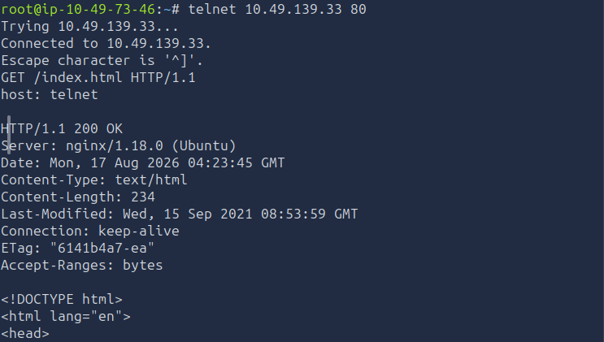
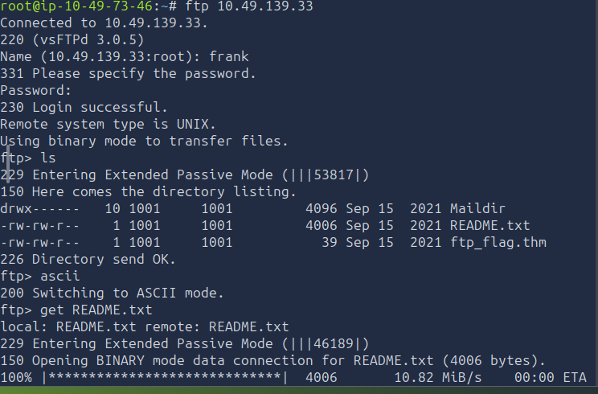
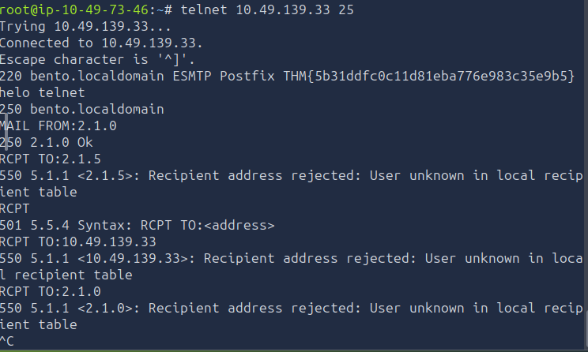
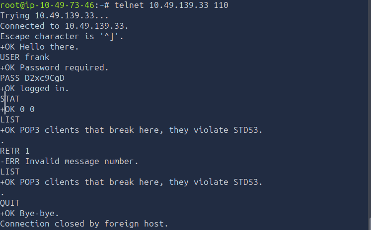

# [Protocols and Servers] — TryHackMe

**Path:** Jr Penetration Tester
**Date:** 2026-08-11
**Category:** Reconnaissance — Service Enumeration

## Objective
Understand common application-layer protocols (HTTP, FTP, POP3, SMTP, IMAP)
and their built-in insecurities — mainly cleartext transmission.

## Tools used
- ftp, curl, telnet, Basic protocol requests, wireshark

## Methodology
- Connected to the given THM lab IP using telnet on port 80(HTTP) and ran few protocol requests to get required results.
- Similarly used telnet to login into a ftp server running on port 21 to get the flag and files
- also ran wireshark for each connection to see the protocols and data in real time as everything was in cleartext format with not encryption including username password and session cookie.
- Similarly tried connecting to POP3 and SMTP server listening on port 110 and port 25 respectively
  

**HTTP request using telnet**

**FTP request using telnet**

**SMTP request using telnet**

**POP3 Request using telnet**

## Detection angle (SOC-relevant)
Cleartext credential transmission is trivially sniffable on the wire if
you're on the same segment or in a MITM position — this is exactly why SOC
teams push for encrypted equivalents (FTPS/SFTP, IMAPS, SMTP+TLS).

## Key takeaway
Anything that is not encrypted in today's world can easily be captured and misused by anyone sniffing on the network.

