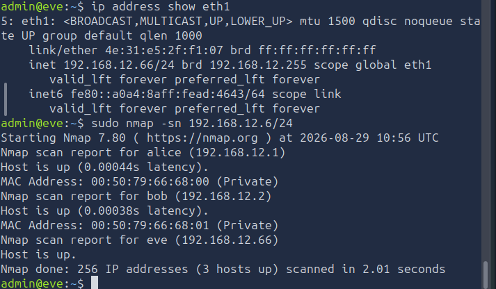
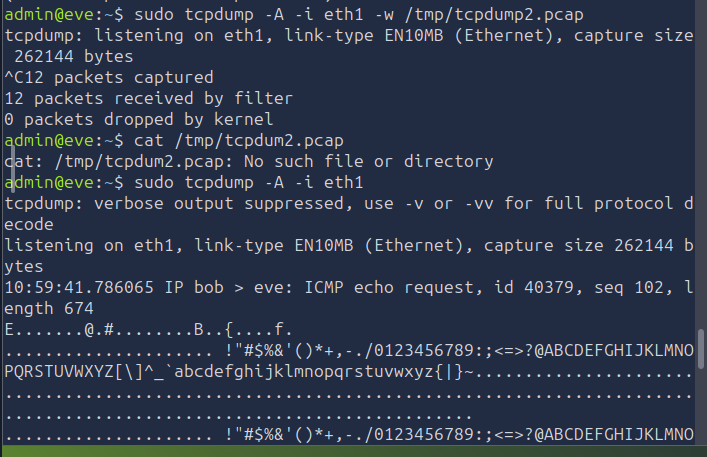
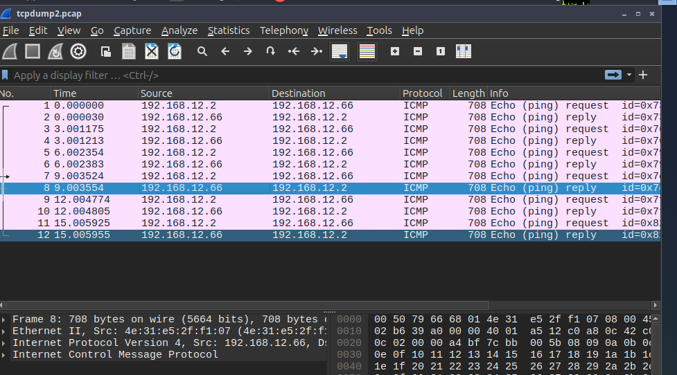
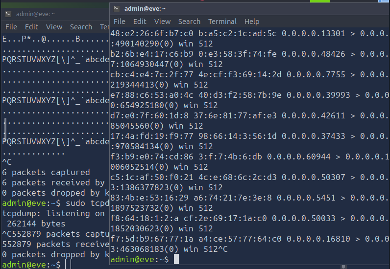
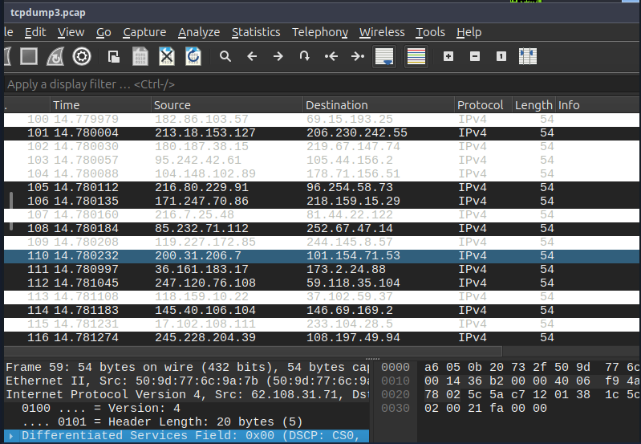
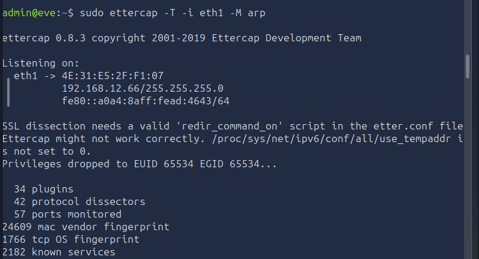
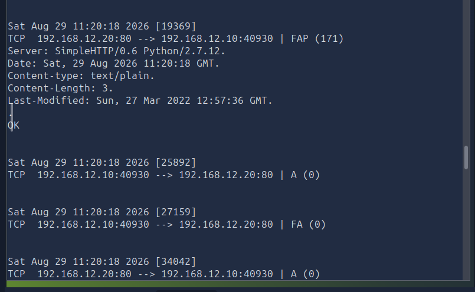
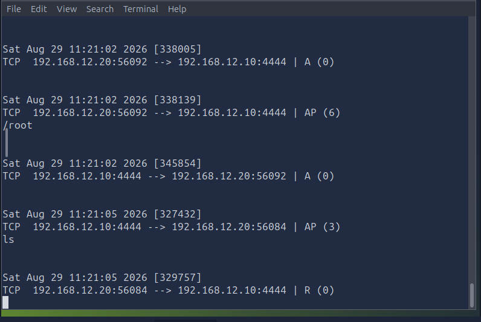
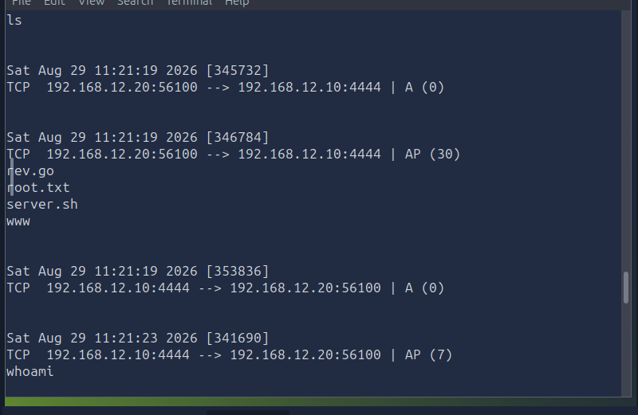

# [ARP Poisoning - L2 MAC flooding and ARP spoofing] — TryHackMe
 
**Path:** Cyber Security 101 / Jr Penetration Tester
**Date:** 2026-08-22
**Category:** Network Security — Man-in-the-Middle
 
## Objective
Understand how ARP poisoning (ARP spoofing) works — exploiting ARP's lack of
authentication to redirect traffic through an attacker-controlled host — and
cover DNS poisoning as the related attack that often follows it.
 
## Tools used
- Ettercap, Wireshark

## Methodology
 
### How ARP normally works
- Address Resolution Protocol - discover mac address from a given IP over a local subnet
- broadcast ARP request, "who has this IP"
- host replies with
its MAC — no authentication step anywhere in this exchange.
- works only for local subnets - filtered by router
 
### ARP Poisoning / Spoofing
- In this room we assumed that we had root access to compromised host in a network.
- using that host firstly we discovered different hosts on the network

  ip addr show eth1
  sudo nmap -sn <ip_range>
  

- analysed network traffic on the intereface using wireshark by analysing contents of .pcap file generated by tcpdump using wireshark.
  

- used MAC flooding using macof to to advantage of switch config which broadcasts all traffic to every post on network if it's mac table is flooded with spoofed mac address leaving no space for genuine path

This allowed me to analyze all traffic on the network without having direct access

- tried to arp spoof the other hosts into believing my machine as genuine server using ettercap but was unsuccessful because both had arp packet validation protocol configured which dropped such packets
  

- In this scenario with different machine with arp validation disabled i was able to spoof arp requests and was able to analyse traffic between other hosts.
  

- although there was more in this room about manual packet manipulation using scripts, that was way to advanced for my current level so left it to that
  
### Observing the MITM position
- in the second scenario where arp validation was disabled i was able to view traffic between two hosts
- the commands they were using
- ports through which traffic was being routed
- users and webservers
- al the communication was in cleartext so i was able to get login credentials to a webserver the hosts were communication through
 
## Detection angle (SOC-relevant)
- **Gratuitous/unsolicited ARP replies** — a host announcing an IP-to-MAC
  mapping without a matching request is a strong ARP-spoofing indicator.
- **Duplicate IP-to-MAC bindings** — the same IP suddenly resolving to two
  different MAC addresses within a short window 
- Sigma/SIEM rule opportunity: alert on ARP reply rate anomalies per host,
  or on IP-MAC binding changes logged by switch features.
## Key takeaway
- Observed how arp requests are hardly authenticated on a local subnet
- anyone on a local subnet can manipulate arp requests and take advantage of trust
- how anyone sniffing on network can determine what a target is talking to and spoof its mac address to reroute traffic through his machine. the traffic can be redirected to original website and results mapped back to target. In this case target might never know he is being watched.
- manipulate packets mid traffic for malicious purposes eg- to a attacker controlled website (DNS poisoning).
 
