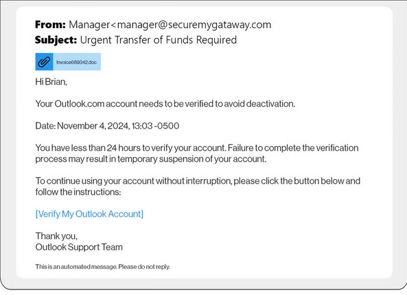

# Sep 14 — Phishing Email Red Flags

**Path:** CompTIA Security+ (SY0-701) / Phishing & Social Engineering  
**Date:** 2026-09-14  
**Category:** Phishing / Social Engineering

## Objective
Annotate three red flags in a real phishing email: sender-domain mismatch, urgency, and a hover-link mismatch.

## Tools used
- Browser / email client
- Markdown notes
- Security+ study material

## Methodology
1. Inspect the **sender address/domain** and compare it with the organization the email claims to represent.
2. Identify **urgency or pressure** intended to make the recipient act without verification.
3. Hover over the visible link and compare the **displayed URL with the actual destination**.
4. Record each red flag directly against the evidence in the email.

### Screenshot / evidence

### Annotation checklist
- **Red flag 1 — Sender domain mismatch:** sender's address does not seem to be from microsoft
- **Red flag 2 — Urgency:** Only gave 24 hours
- **Red flag 3 — Hover-link mismatch:** masked link to a possible malicious website

## Detection angle (SOC-relevant)
A SOC may correlate sender-domain anomalies, malicious or newly observed URLs, email authentication failures, and user-reported phishing messages. The link destination and sender-domain evidence can be useful indicators during triage.

## Key takeaway
Phishing detection is often about combining several small inconsistencies rather than relying on one suspicious feature alone.
