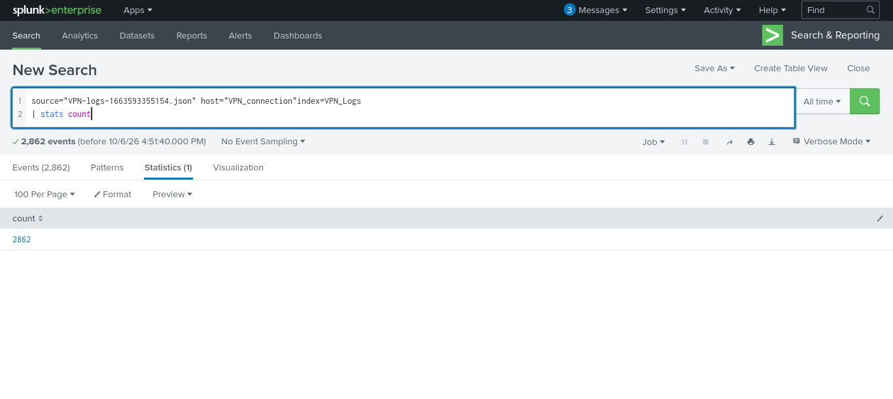
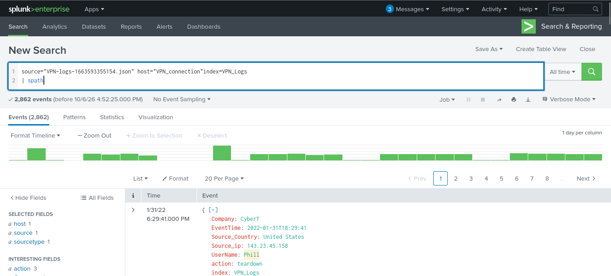
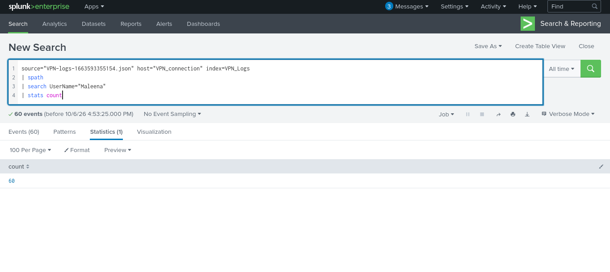
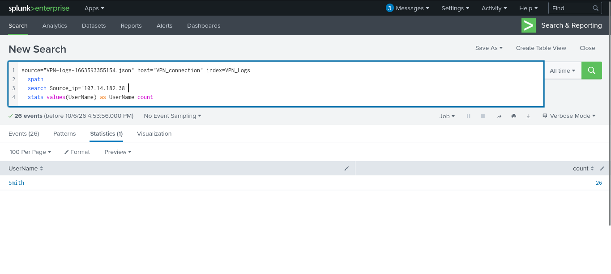
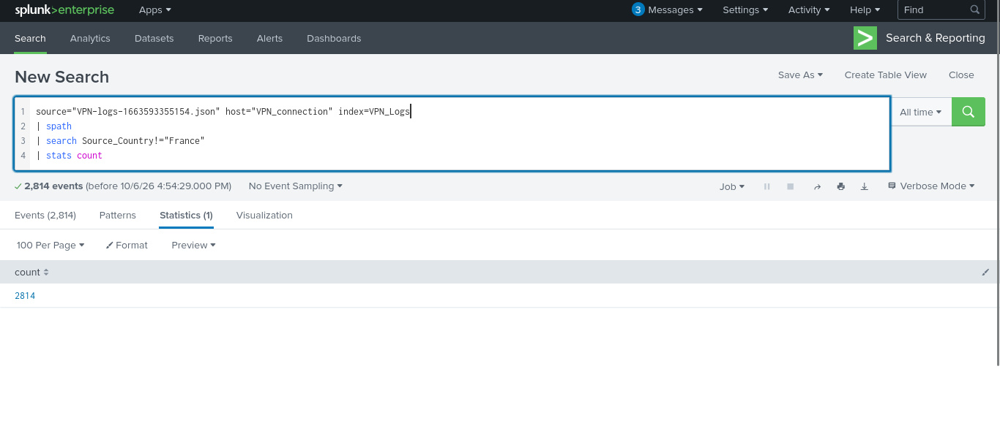

# Advent of Cyber Day 3 — Splunk Basics - Did You SIEM? — TryHackMe

**Path:** Advent of Cyber 2025  
**Date:** 2026-10-06  
**Category:** SIEM / Log Analysis / Detection

## Objective

This room introduces the basics of **Splunk Enterprise** for searching, parsing, and analysing log data. The investigation focuses on using SPL searches to extract useful fields from VPN connection logs and answer investigation questions.

## Tools used

- Splunk Enterprise
- Splunk Search & Reporting
- SPL (Search Processing Language)
- TryHackMe lab machine

## Methodology

### 1. Identify the available VPN log data

The investigation starts by searching the `VPN_Logs` index and counting the available events. This establishes the size of the dataset before filtering it.

```spl
source="VPN-logs-1663593355154.json" host="VPN_connection" index=VPN_Logs
| stats count
```

The search returned **2,862 events**.



### 2. Parse the JSON fields with `spath`

The VPN data is JSON-based, so `spath` is used to extract the fields contained inside each event. This makes values such as `UserName`, `Source_Country`, `Source_ip`, `Company`, and `action` available for searching and analysis.

```spl
source="VPN-logs-1663593355154.json" host="VPN_connection" index=VPN_Logs
| spath
```

The resulting event view shows the extracted fields, including the source country, source IP, username, and VPN action.



### 3. Investigate activity for a specific user

Next, the parsed `UserName` field is used to isolate events associated with **Maleena**. `stats count` then gives the number of matching log events.

```spl
source="VPN-logs-1663593355154.json" host="VPN_connection" index=VPN_Logs
| spath
| search UserName="Maleena"
| stats count
```

The search returned **60 events** for Maleena.



### 4. Pivot from a source IP to the associated username

A source IP can also be used as an investigation pivot. The following search filters on the specified source IP and returns the usernames observed from it, along with their event count.

```spl
source="VPN-logs-1663593355154.json" host="VPN_connection" index=VPN_Logs
| spath
| search Source_ip="107.14.92.1"
| stats values(UserName) as UserName count
```

The result associates the IP address **107.14.92.1** with **Smith**, with **26 events** returned for the matching activity.



### 5. Filter activity by source country

The final demonstrated search filters out events whose `Source_Country` is France and then counts the remaining events.

```spl
source="VPN-logs-1663593355154.json" host="VPN_connection" index=VPN_Logs
| spath
| search Source_Country!="France"
| stats count
```

The search returned **2,814 events** after excluding France from the results.



## Detection angle (SOC-relevant)

These searches demonstrate a simple SOC investigation workflow:

1. **Establish scope** — count the events in the relevant index.
2. **Parse structured logs** — use `spath` to expose JSON fields.
3. **Pivot on an identity** — investigate activity for a particular username.
4. **Pivot on an indicator** — use a source IP to identify associated users.
5. **Filter on geographic context** — compare or exclude activity based on source country.

For a SIEM alert, useful fields from these VPN logs would include:

- `UserName`
- `Source_ip`
- `Source_Country`
- `Company`
- `action`
- `EventTime`

A SOC analyst could use these fields to pivot from an alert into the surrounding authentication/VPN activity and determine whether the source, account, location, and action are consistent with expected behaviour.

## Key takeaway

The main lesson is that effective Splunk investigation is not just about knowing commands; it is about **turning raw logs into searchable fields and then pivoting through those fields to build context**. `spath`, `search`, and `stats` provide a compact workflow for moving from a large event set to focused investigative evidence.
