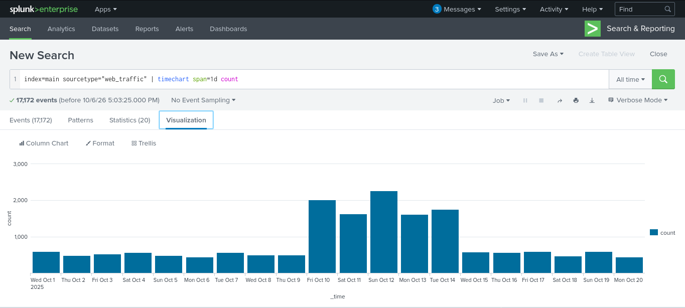
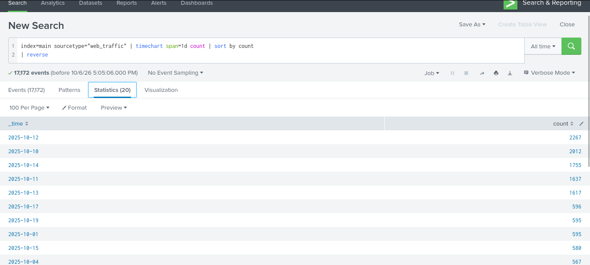
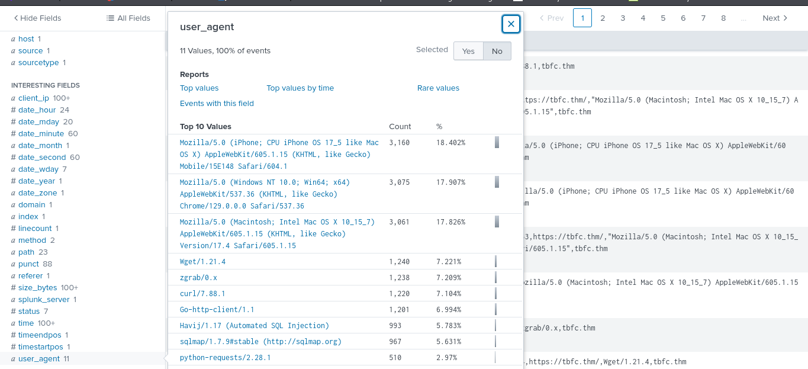
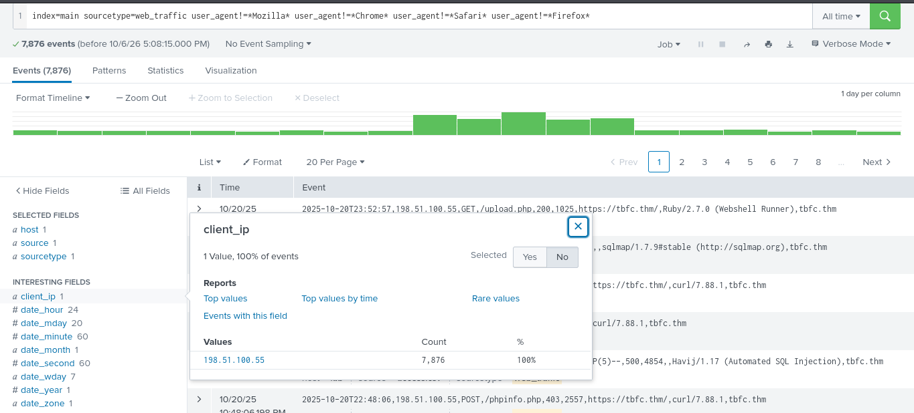
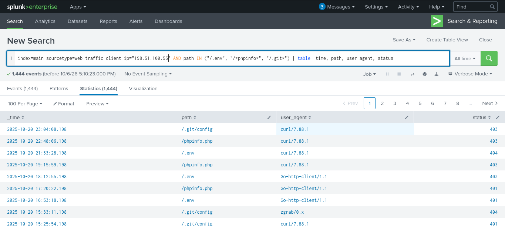
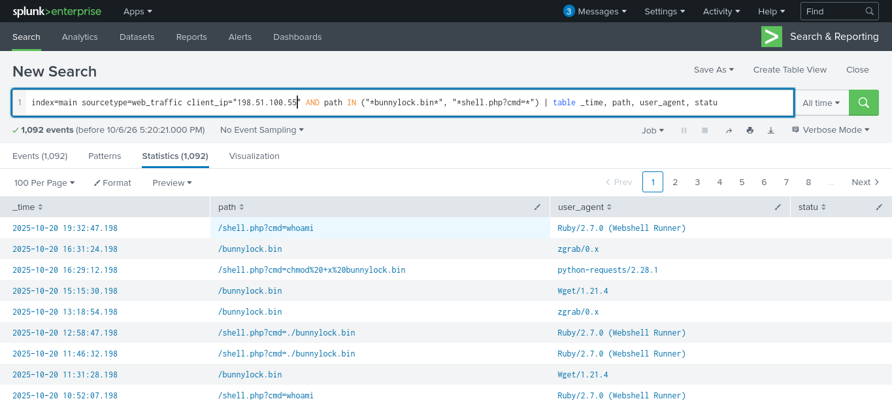
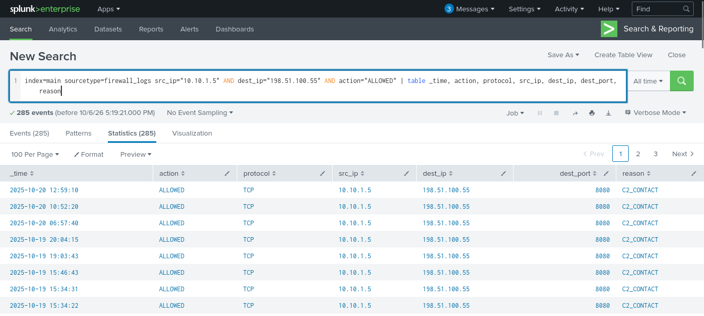
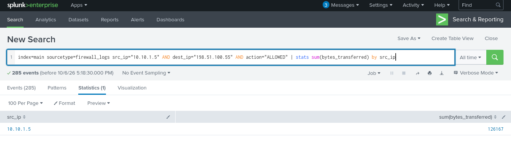

# Splunk Basics - Did you SIEM? — TryHackMe

**Path:** Advent of Cyber Day 3  
**Date:** 2026-10-06  
**Category:** Detection / SIEM / Log Analysis

## Objective

Learn how to ingest and parse custom log data using Splunk, then investigate a web-server attack by pivoting between web traffic and firewall logs. The investigation covers anomaly detection, reconnaissance, vulnerability testing, SQL injection, data exfiltration, ransomware staging/RCE, C2 communication, and transferred-data volume.

## Tools used

- Splunk Enterprise — Search & Reporting
- Splunk Search Processing Language (SPL)

## Methodology

### 1. Exploring the logs

The room data is already pre-ingested into Splunk. I started in **Search & Reporting** and searched the main index across **All time**:

```spl
index=main
```

The results showed two custom datasets. Checking the `sourcetype` field identified:

- `web_traffic` — web connections to and from the web server.
- `firewall_logs` — firewall traffic showing whether connections were allowed or blocked.
- The room identifies the web server's local IP as `10.10.1.15`.

---

### 2. Initial triage of web traffic

I narrowed the search to the custom web-traffic source type:

```spl
index=main sourcetype=web_traffic
```

This returned **17,172 events**.

The important fields included `user_agent`, `path`, `status`, and `client_ip`, which showed that Splunk had successfully parsed the web-log structure.

---

### 3. Visualizing the log timeline

To determine when abnormal activity occurred, I grouped events by day:

```spl
index=main sourcetype=web_traffic | timechart span=1d count


```

The timeline showed the normal daily event volume followed by a distinctive spike, indicating a period of unusually intense activity.

I then reversed the results so the highest-volume period could be examined first:

```spl
index=main sourcetype=web_traffic | timechart span=1d count | sort by count | reverse


```

The room identifies this intense period as the main attack phase launched by King Malhare.

---

### 4. Anomaly detection

I examined three useful fields for suspicious values:

- `user_agent` — to identify unusual tools instead of normal browsers.
- `client_ip` — to identify the source generating suspicious traffic.
- `path` — to identify malicious or unusual requested resources.

The investigation found a large number of suspicious user agents in addition to legitimate Mozilla/browser traffic, and one client IP stood out from the rest.



---

### 5. Filtering out benign browser traffic

Because the attackers were using scripts and tools rather than standard browsers, I removed common legitimate user agents:

```spl
index=main sourcetype=web_traffic user_agent!=*Mozilla* user_agent!=*Chrome* user_agent!=*Safari* user_agent!=*Firefox*
```

The remaining events revealed the suspicious client IP responsible for the non-browser traffic. That IP was then used as the attacker IP for the following investigation stages.



---

### 6. Identifying the dominant suspicious IP

To rank suspicious IPs by request volume, I used:

```spl
sourcetype=web_traffic user_agent!=*Mozilla* user_agent!=*Chrome* user_agent!=*Safari* user_agent!=*Firefox* | stats count by client_ip | sort -count | head 5
```

The `-count` sort orders the results by count in reverse order, allowing the highest-volume suspicious IP to be selected for deeper investigation.

---

### 7. Reconnaissance / footprinting

With the suspicious IP identified, I searched for probes against exposed configuration and information files:

```spl
sourcetype=web_traffic client_ip="<REDACTED>" AND path IN ("/.env", "/*phpinfo*", "/.git*") | table _time, path, user_agent, status
```

The results showed reconnaissance activity using low-level tools such as `curl` and `wget`, with responses including `404`, `403`, and `401`.



This established the initial footprinting phase of the attack.

---

### 8. Enumeration / vulnerability testing

I then searched for path-traversal and open-redirect activity:

```spl
sourcetype=web_traffic client_ip="<REDACTED>" AND path="*..*" OR path="*redirect*"
```

To count the targeted paths more clearly, I used:

```spl
sourcetype=web_traffic client_ip="<REDACTED>" AND path="*..\/..\/*" OR path="*redirect*" | stats count by path
```

The results showed attempts to access resources containing traversal patterns such as `../../`, indicating that the attacker had moved beyond simple reconnaissance into active vulnerability testing and attempts to read system files.

---

### 9. SQL injection attack

To identify the automated SQL-injection tooling and its payloads, I searched for known tool user agents:

```spl
sourcetype=web_traffic client_ip="<REDACTED>" AND user_agent IN ("*sqlmap*", "*Havij*") | table _time, path, status
```

The results showed known SQL-injection tooling and attack strings such as `SLEEP(5)`. The room notes that a `504` status code can be an indicator of a successful time-based SQL injection attempt.

---

### 10. Exfiltration attempts

Next, I searched for requests associated with large sensitive archives:

```spl
sourcetype=web_traffic client_ip="<REDACTED>" AND path IN ("*backup.zip*", "*logs.tar.gz*") | table _time path, user_agent
```

The results indicated attempts to download compressed log archives. The room notes the use of tools such as `curl` and `zgrab`, and this activity was then correlated with the firewall logs.

---

### 11. Ransomware staging and remote code execution

The investigation then searched for requests associated with the suspected webshell and ransomware payload:

```spl
sourcetype=web_traffic client_ip="<REDACTED>" AND path IN ("*bunnylock.bin*", "*shell.php?cmd=*") | table _time, path, user_agent, status
```

The results showed requests involving `bunnylock.bin` and `shell.php?cmd=`.

The room interprets this as successful webshell execution and **Remote Code Execution (RCE)**, including execution of:

```text
./bunnylock.bin
```

This indicates the attacker had progressed from probing and exploitation to executing a malicious payload on the server.



---

### 12. Correlating outbound C2 communication

I pivoted from the web logs to the firewall logs, using the compromised server IP `10.10.1.5` as the source and the previously identified attacker IP as the destination:

```spl
sourcetype=firewall_logs src_ip="10.10.1.5" AND dest_ip="<REDACTED>" AND action="ALLOWED" | table _time, action, protocol, src_ip, dest_ip, dest_port, reason
```

The result showed an **ALLOWED** outbound connection from the compromised server to the attacker's C2 IP. The room specifically identifies `REASON=C2_CONTACT` as evidence that the malware communication channel was active.



---

### 13. Measuring the amount of data transferred

Finally, I calculated the total bytes transferred to the attacker-controlled C2 endpoint:

```spl
sourcetype=firewall_logs src_ip="10.10.1.5" AND dest_ip="<REDACTED>" AND action="ALLOWED" | stats sum(bytes_transferred) by src_ip
```

The result showed a high volume of data transferred from the compromised server to the C2 server, supporting the exfiltration finding.



## Detection angle (SOC-relevant)

This investigation is a good example of correlating multiple log sources rather than treating a single alert as the whole incident.

**Primary log sources:**
- `web_traffic` — web requests, client IPs, user agents, paths, and status codes.
- `firewall_logs` — allowed/blocked network traffic, source/destination IPs, destination ports, reasons, and transferred bytes.

**Useful indicators and detection points:**
- Non-browser user agents such as `curl`, `wget`, `sqlmap`, and `Havij`.
- One client IP generating a disproportionately high volume of suspicious requests.
- Requests for sensitive paths such as `/.env`, `/.git*`, and `*phpinfo*`.
- Path-traversal patterns involving `../../`.
- SQL-injection indicators such as `SLEEP(5)`.
- Requests for `backup.zip` and `logs.tar.gz`.
- Webshell activity involving `shell.php?cmd=`.
- Execution of `bunnylock.bin`.
- Firewall activity showing `action="ALLOWED"` from the compromised server to the attacker/C2 IP.
- `reason=C2_CONTACT`.
- A large `sum(bytes_transferred)` from the compromised server toward the C2 endpoint.

The investigation demonstrates a complete attack chain: **reconnaissance → enumeration → exploitation → payload execution → C2 communication → data exfiltration**.

## Key takeaway

The strongest lesson is the value of **pivoting between fields and log sources**. Starting with abnormal web traffic led to the attacker IP, which could then be traced through reconnaissance, exploitation, RCE, and finally confirmed C2 communication and data transfer in the firewall logs.
