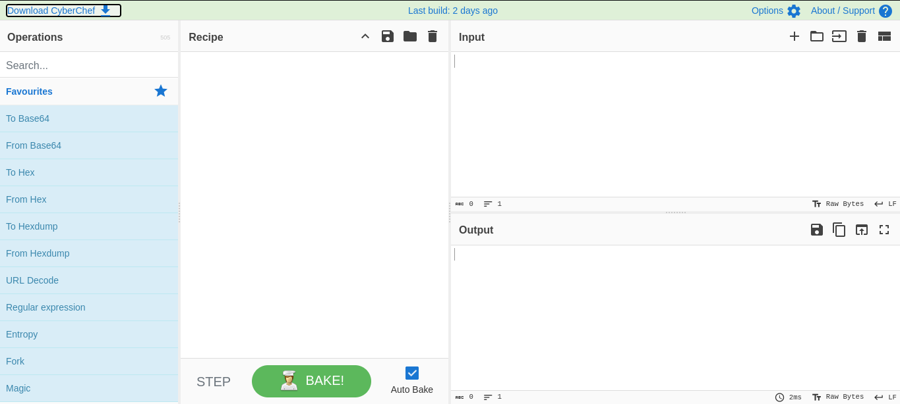
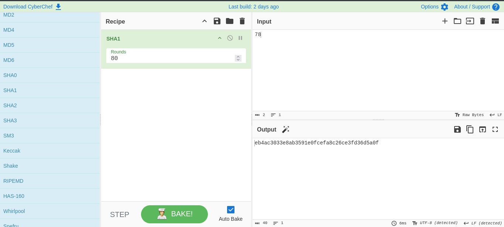
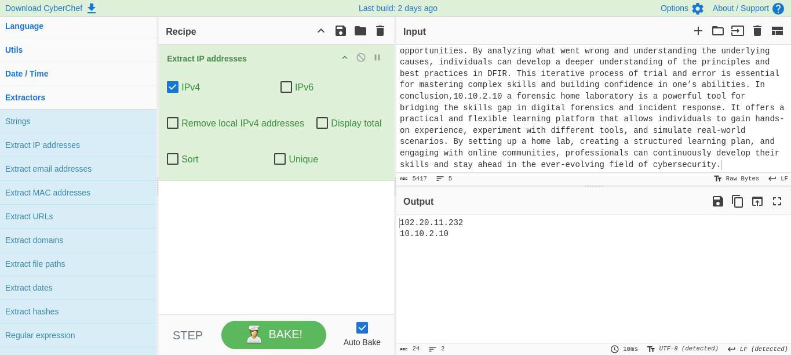
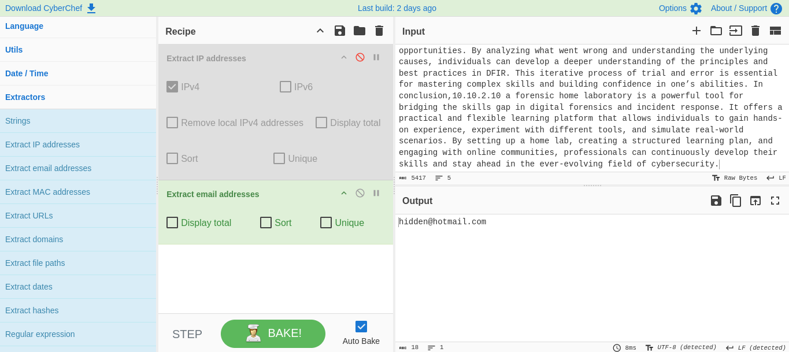

# CyberChef Basics

**Category:** Data Analysis / CTF Tooling

## Objective
Get comfortable with CyberChef's four-panel layout and the handful of
operations (encoding, extraction, timestamp conversion) that come up
constantly in CTFs and log analysis — plus chaining them for
multi-layered encoded data.

## Tools used
CyberChef (web-based)

## Methodology

### The Four Areas
```
Operations  →  Recipe
Input       →  Output
```
- **Operations** — the full library of transformations, grouped by
  category (encoding, extraction, date/time, etc.)
- **Recipe** — where you drag operations in and stack them in order
- **Input** — the data you're feeding in (text, encoded strings, file
  contents)
- **Output** — the result after your recipe runs



Basic loop: paste into Input → drag an Operation into Recipe → check
Output → adjust/add more operations → repeat.

### Encoding Operations (not encryption — worth repeating)

**Base64**
```
To Base64:    readable data → base64 string
From Base64:  base64 string → readable data
```

**Hex**
```
To Hex: input string → hex bytes
```

**Decimal**
Represents input as a decimal integer array — handy for eyeballing
character/byte values directly.

**ROT13**
Caesar shift of 13. `HELLO → URYYB`, and running it again gets you back
to `HELLO` — it's its own inverse. Purely obfuscation, breaks in about
two seconds against anyone who knows what ROT13 is.



**None of the above are encryption.** They're representations/encodings
— reversible by anyone, no key required. Don't let "it's encoded" get
mistaken for "it's protected" in a writeup or a real investigation.

### Extraction Operations
Pull structured patterns out of a wall of text:
- **Extract IP Address**
- **Extract URLs**
- **Extract Emails**






These are the ones that actually save real time during log analysis or a
CTF — instead of eyeballing a huge blob of text for anything
IP-shaped, let CyberChef pull every match at once.

### Date/Time
```
From UNIX Timestamp: 1700000000 → readable date/time
To UNIX Timestamp: date/time → UNIX timestamp
```
Comes up constantly when a log or artifact only stores epoch time and
you need it human-readable for a timeline.

### More Decoding Operations
```
From Base64
URL Decode
From Base85
From Base58
```
All useful when something's wrapped in more than one layer of encoding —
which is basically guaranteed in any CTF crypto/misc challenge worth
doing.

### Chaining
The actual power move is stacking operations — order matters, each step
feeds the next:
```
Input → From Base64 → URL Decode → ROT13 → Output
```
Don't blindly stack five operations and hope. Check the output after
each meaningful step — if something looks like garbage instead of
partially-readable text, you picked the wrong operation or the wrong
order, and it's much faster to catch that one step in instead of five
steps deep.

## Detection angle (SOC-relevant)
CyberChef itself isn't a detection tool, but the extraction operations
map directly onto SOC log-triage work — "pull every IP/URL/email out of
this blob" is a real step in investigating a phishing email or a
suspicious log dump, not just a CTF trick. The bigger detection-relevant
point: seeing Base64/hex/ROT13-style transforms in something like a
PowerShell command line or a suspicious payload is itself a signal worth
flagging — attackers use exactly these "not encryption" encodings to
slip past naive string-matching detections, so recognizing the pattern
(and decoding it fast) is a real triage skill, not just a CTF one.

## Key takeaway
CyberChef's value isn't any single operation — it's that chaining lets
you peel back layered encoding fast without writing throwaway scripts
for every combination. The one thing worth internalizing: encoding and
encryption are not the same category of thing, and CyberChef's entire
"Data Conversion" section is squarely on the encoding side of that line.

