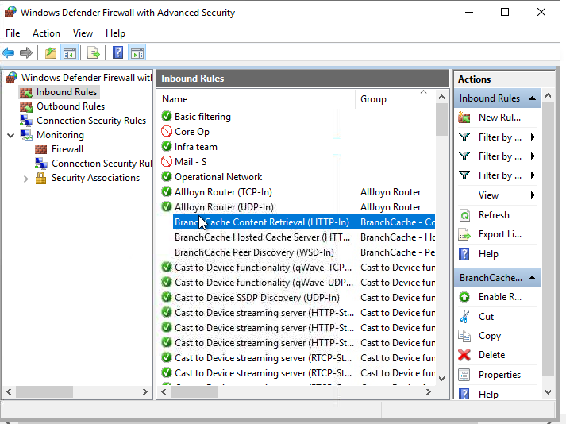
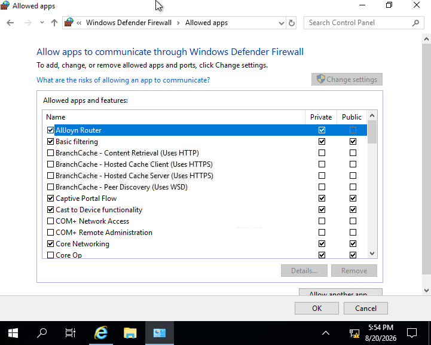
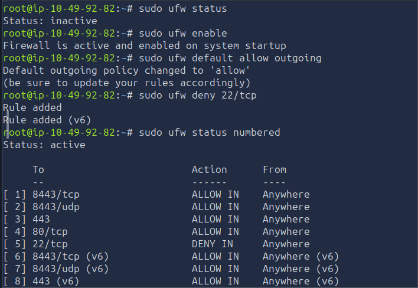

# [Firewall Fundamentals] — TryHackMe

**Path:** Jr Penetration Tester / Network Security
**Date:** 2026-08-19
**Category:** Network Security — Defensive Controls

## Objective
Understand how firewalls work — packet filtering, stateful vs stateless
inspection, rule ordering — and how they fit into a network's defense
layers.

## Methodology
- This room was more about a combination of theory and practical
- Firstly we learnt about different types of firewalls i.e stateless, stateful, proxy etc.
- Then it was about rules in a firewall and what actions are taken based on those rules.

- for windows firewall, I analyzed the inbuilt inbound and outbound rules for different ports and protocols
- made a custom rule to block http traffic over port-80 of my own

- for linux, inside the lab machine I ran few commands with ufw to activate firewall, configure the incoming and outgoing traffic, configure and check the default rules.

**Analyzing inbound rules in a windows inbuilt firewall lab**

**Configuring linux firewall(ufw)**

## Detection angle (SOC-relevant)
Firewall logs are one of the most valuable SOC data sources — denied
connection attempts, especially repeated ones from the same source or
against multiple ports, are a primary signal for scan/attack detection.
Understanding rule logic here directly informs what firewall log alerts
should actually look for.

## Key takeaway
[Fill in]
EOF
