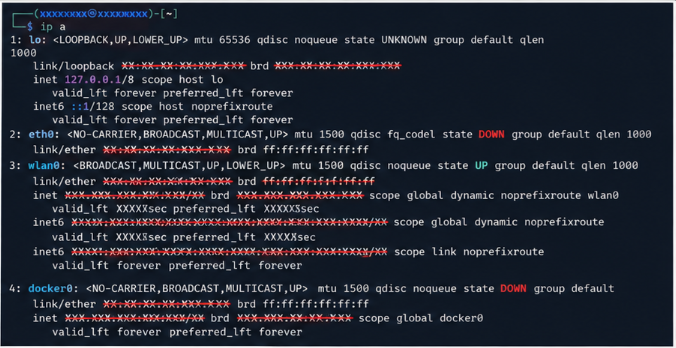
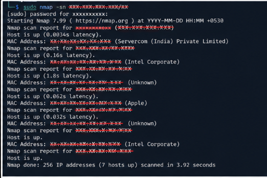
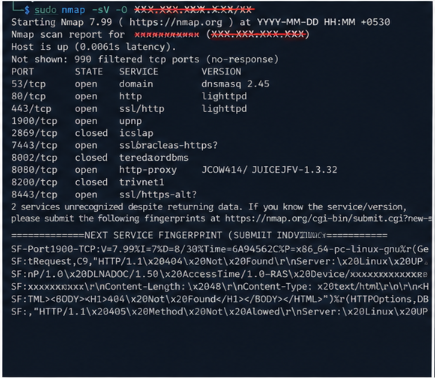
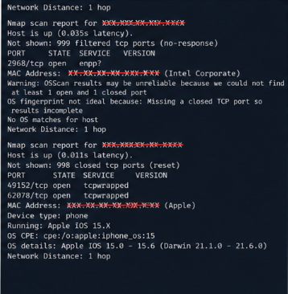
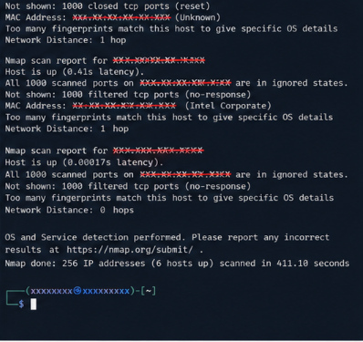

# Home Network Nmap Scan — Personal Recon Exercise
 
**Date:** 2026-08-14
**Category:** Network Reconnaissance — Applied
 
## Objective
Apply Nmap skills from the THM "Nmap" room against my own home network rather
than a lab target — practice host discovery and service enumeration in a
real, uncontrolled environment, and think through what an attacker on the
same network could learn.
 
> **Note on redaction:** this repo is public. Real IP ranges, MAC addresses,
> and device hostnames are replaced with placeholders below. Only the
> pattern/structure of findings is documented, not identifying details.
 
## Environment
- Network: Home WiFi, subnet `192.168.X.0/24` (redacted)
- Scanning host: Kali Linux, connected via `wlan0` (eth0/docker0 interfaces were down for this exercise)
## Methodology
 
### 1. Identify local subnet
```bash
ip a
```

 
Confirmed the scanning host was on `wlan0`, assigned an address in the
`192.168.X.0/24` range — this is the subnet targeted for the rest of the scan.
 
### 2. Host discovery (ping sweep)
```bash
sudo nmap -sn 192.168.X.0/24
```

 
**Findings:**
7 hosts responded out of 256 addresses scanned, in under 4 seconds. Based on
MAC vendor prefixes:
- **1 host — vendor "Servercom (India) Private Limited"** — almost certainly
  the Airtel router itself (ISP-assigned gateway hardware).
- **2 hosts — vendor "Intel Corporate"** — likely laptops/PCs with Intel
  network adapters.
- **1 host — vendor "Apple"** — a phone or Mac.
- **2 hosts — vendor "Unknown"** — MAC prefix not in Nmap's vendor database,
  likely IoT devices or hardware with a less common chipset.
- 1 additional host responded to ping but didn't return a resolvable vendor.
### 3. Detailed scan across the subnet
```bash
sudo nmap -sV -O 192.168.X.0/24
```



 
This took ~411 seconds and returned detailed results for 6 of the 7 hosts
found in the ping sweep (one dropped off — possibly a mobile device that
went idle/disconnected between scans).
 
**Router (gateway) — most interesting host:**
| Port | State | Service | Version |
|------|-------|---------|---------|
| 53/tcp | open | domain | dnsmasq 2.45 |
| 80/tcp | open | http | lighttpd |
| 443/tcp | open | ssl/http | lighttpd |
| 1900/tcp | open | upnp | — |
| 7443/tcp | open | ssl/unknown | — |
| 8080/tcp | open | http-proxy | unusual banner (unrecognized) |
| 8443/tcp | open | ssl/https-alt | — |
| 2869, 8002, 8200/tcp | closed | — | — |
 
OS fingerprinting failed ("no OS matches for host") since Nmap needs at
least one definitively closed port alongside an open one for a reliable
signature — the router's port state mix wasn't clean enough to confirm.
 
**Device with Intel NIC:**
Only one open port found — `2968/tcp`, service unrecognized ("enpp?").
Everything else filtered. OS detection unreliable for the same reason as
above (no clean open+closed port pair).
 
**Apple device:**
```
49152/tcp open  tcpwrapped
62078/tcp open  tcpwrapped
Device type: phone
Running: Apple iOS 15.X
OS details: Apple iOS 15.0 - 15.6
```
Port `62078` is a well-known Apple-specific port (`lockdownd`, used for
iOS device sync/pairing) — this is a strong, recognizable fingerprint that
correctly identified the device as an iPhone without needing a manual guess.
 
**Remaining hosts (2–3 devices):**
Returned "all 1000 scanned ports filtered (no-response)" — fully locked
down from a port-scan perspective, no usable service fingerprint at all.
 
## Observations / Risk Notes
- The router exposes **more than I expected for stock ISP hardware** — a web
  admin panel on 80/443 (expected), but also UPnP on 1900 and an unidentified
  proxy-like service on 8080 with a banner Nmap couldn't classify. UPnP in
  particular is a known soft spot on consumer routers since it can be abused
  to auto-open port forwards without authentication.
- Two closed-vs-filtered mismatches on the router prevented OS fingerprinting
  — not a security issue by itself, but it shows Nmap's OS detection is
  fragile against inconsistently configured firewalls, which cuts both ways
  (harder for me to fingerprint, but also harder for an actual attacker).
- The Apple device's identification via port 62078 is a good reminder that
  **you don't need an open "juicy" port to be fingerprinted** — a single
  vendor-specific service port was enough to confirm device type and OS
  version range with no guessing involved.
- Didn't attempt to access the router's admin panel or test default
  credentials — this exercise was about visibility, not exploitation.
## Detection angle (SOC-relevant)
Home networks usually have zero monitoring, which is exactly the point of
this exercise — contrast that with an enterprise network where:
- A ping sweep across an internal subnet would show up as many ICMP
  requests in sequence from one source — easy to flag with basic network
  monitoring (something home routers never do).
- Detailed `-sV -O` scans generate a recognizable pattern of probe packets
  per host that an IDS (like the one covered in the IDS Fundamentals room)
  would typically have signatures for. A 411-second scan sweeping an entire
  /24 would be a loud, easily-flagged event on any monitored network.
- This is a good illustration of why internal network visibility matters —
  most home networks (and many small businesses) have literally zero
  detection capability for this kind of internal recon.
## Key takeaway
Scanning a lab target tells you whether a tool works; scanning your own
network tells you what's actually sitting exposed on hardware you didn't
configure yourself. The router alone had more open, unexplained services
(UPnP, an unrecognized 8080 proxy) than I expected from stock ISP-provided
hardware — a good reminder that "default" doesn't mean "minimal attack
surface."
 
