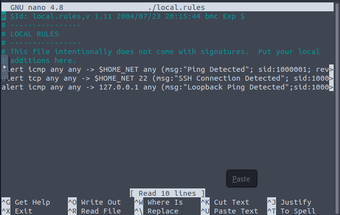
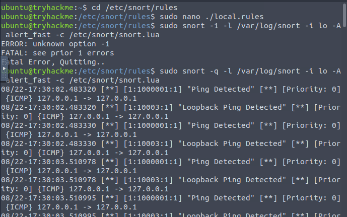

# [IDS Fundamentals] — TryHackMe

**Path:** Cyber Security 101 — Security Solutions
**Date:** 2026-08-22
**Category:** Detection — IDS / Signature-based Rules

## Objective
Understand what an Intrusion Detection System (IDS) is, the difference
between IDS types, and get hands-on with Snort — writing and testing
custom detection rules.

## Tools used
- Snort

## Snort Rule Format
Action  Protocol  Source IP  Source Port  ->  Destination IP  Destination Port

eg:
alert   icmp      any        any           ->  $HOME_NET       any

1. Action
   What action is triggered.

2. Protocol
   Protocol that matches the rule.

3. Source IP

4. Source Port

5. Destination IP
   Any IP / network range.

6. Destination Port

7. Rule Metadata
   i) Msg: Message displayed when rule is triggered.
   ii) SID (Sign ID): Every rule has a unique ID that differentiates it from others.
   iii) Rule Revision: Keeps track of changes in the rule (+1).

## Methodology

- Learnt about what is a IDS(Intrusion Detection System) and how it detects threats inside a network
- What are the types of IDS - Signature based, Anomally based and Hybrid 
- Snort Startup Command
  sudo snort -q -l /var/log/snort -i lo -A alert_fast -c /etc/snort/snort.lua
  
Meaning : Run Snort quietly (-q)
using /etc/snort/snort.lua (config file for Snort 3),
monitoring the local loopback interface (lo),
and write fast-format alerts/logs (-A alert_fast)
under /var/log/snort.

- Snort PCAP Analysis Command
  
  sudo snort -q -l /var/log/snort -r Task.pcap -A alert_fast -c /etc/snort/snort.lua

- analysed the logs of a give pcap file using snort to detect the threats and the IPs from which the attack was being carried out
also analyzed the alert message generated including the reason behind it

**Snort Custom Rule and Check**

## Detection angle (SOC-relevant)
This room *is* the detection angle — Snort rules are literally what a
SOC/IDS analyst writes and tunes. Key point to note: signature-based IDS
(like this) only catches known patterns — it won't flag anything that
doesn't match an existing rule, which is why anomaly-based detection and
behavioral baselining (SIEM correlation, Sigma rules) matter as a
complement, not a replacement.

## Key takeaway
Snort is a great tool when it comes to analyzing a network based on rules
it is somewhat similar to firewall but instead acting as a barricade to network it works inside the network as a NIDS.
