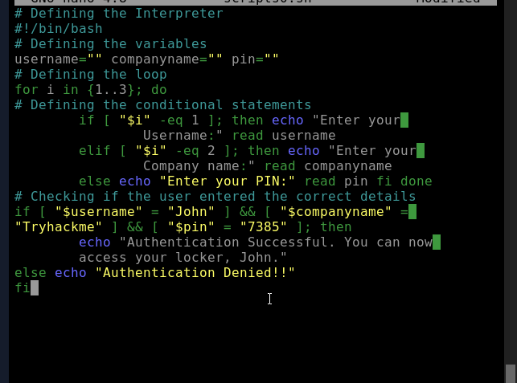
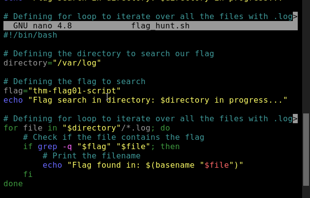
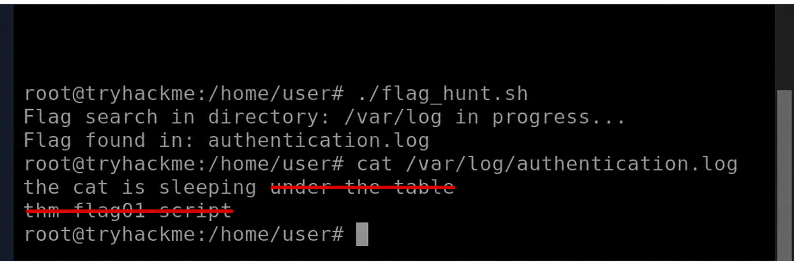

# Linux Shells — TryHackMe

**Path:** Cyber Security 101 — Command Line
**Date:** 2026-09-05
**Category:** Linux / Shell Scripting

## Objective

Last room in the Command Line module, switching over to Linux — what a shell actually is, the common ones you'll run into (Bash, Zsh, Fish), and enough Bash scripting to write something with variables, input, loops, and conditionals.

## Tools used

- Bash
- nano
- chmod
- echo, read, cat

## Methodology

Opened with the basic definition — a shell is just the interface sitting between you and the OS, and Bash (Bourne Again Shell) is the one you'll hit as default on most Linux distros. Quick checks for this:

```bash
echo $SHELL
cat /etc/shells
```

The room covers three shells at a glance — Bash (the default workhorse, scripting-focused, has history and tab completion), Fish (friendlier syntax, autosuggestions, more "out of the box" pleasant), and Zsh (more advanced completion and customization, especially with a framework like Oh My Zsh on top). Functionally similar goals, different levels of hand-holding.

Then into actual scripting. First script is the obligatory hello-world:

```bash
#!/bin/bash

echo "Hello, world!"
```

That first line is the shebang — `#!/bin/bash` — telling the system which interpreter should run the file. Skip it and you're relying on however the script gets invoked to guess correctly, which isn't a great habit.

Variables next — `read` grabs input from the user into a variable, and `$name` pulls the value back out:

```bash
#!/bin/bash

echo "What is your name?"
read name

echo "Welcome $name"
```

To actually run a script, it needs execute permission first:

```bash
chmod +x first-script.sh
./first-script.sh
```

The `./` matters — just typing `first-script.sh` will usually fail since the current directory isn't normally on `PATH`, which tripped me up for a second until I remembered why (it's a deliberate security thing, not an oversight — otherwise a malicious script dropped in a shared directory could shadow a real command).

Loops — a basic `for` over a range:

```bash
for i in {1..10}
do
    echo "$i"
done
```

Conditionals follow the if/then/else/fi structure:

```bash
#!/bin/bash

echo "Enter name:"
read name

if [ "$name" = "Stewart" ]; then
    echo "Welcome sir!"
else
    echo "You do not belong here!"
fi
```

and comments are just anything after a `#`, same as most scripting languages.

Room wraps up combining all of it into a small credential-check script — variables, three `read` prompts, and a chained `if` with `&&`:

```bash
#!/bin/bash

username=""
companyname=""
pin=""

echo "Enter your username:"
read username

echo "Enter your company name:"
read companyname

echo "Enter your PIN:"
read pin

if [ "$username" = "admin" ] && [ "$companyname" = "ExampleCorp" ] && [ "$pin" = "1234" ]; then
    echo "Access granted."
else
    echo "Access denied."
fi
```



this is a teaching example only. Hard-coding credentials into a script like this is exactly the kind of thing you'd flag in a real code review — plaintext secrets sitting in a file anyone with read access can just `cat` open.

**a little challenge inside the rooms involved editing a script and finding the flag**





## Detection angle (SOC-relevant)

Shell history and auditd/bash logging are the relevant pieces here — if a script like the credential-check example above genuinely existed on a production box, that's a finding in itself (hardcoded creds), separate from whatever it's used for. More generally, unexpected shell script creation, scripts calling `chmod +x` on themselves or on newly dropped files, and scripts running from world-writable directories are all things worth a second look.

## Key takeaway

Simple room, but it's the room that actually makes the earlier CMD/PowerShell material click into a bigger pattern — every OS gives you a shell, a way to script it, and the same building blocks underneath (variables, input, conditionals, loops), just with different syntax on top.
