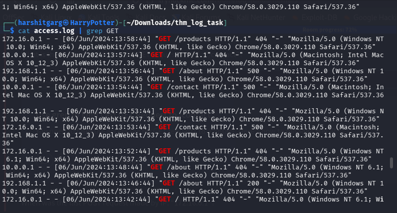
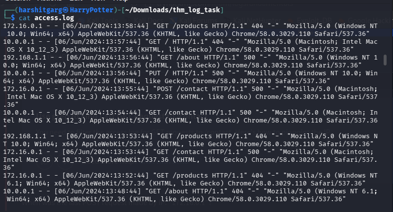
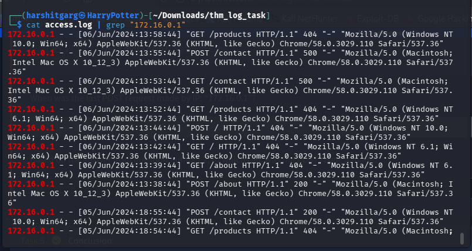

# Logs Fundamentals

**Category:** Defensive Security — Log Analysis

## Objective
Understand what logs actually are, the major log categories, how to read
Windows Event Log IDs and web server access logs specifically, and build
real command-line fluency (`grep`/`awk`) for filtering and frequency
analysis rather than just reading logs passively.

## Methodology

### What Is a Log?
A **log** is a recorded trace of activity produced by an operating
system, application, network device, security product, or other system —
providing historical evidence of what happened.

**Use cases:** security event monitoring, incident investigation/
forensics, troubleshooting, performance monitoring, auditing/compliance.

**Why logs matter to a SOC** — without logs, analysts have limited
visibility. Logs help answer: Who performed an action? What action
occurred? Where? When? What resource was accessed? Was it successful?
What happened before/after?

### Types of Logs

| Type | Purpose | Examples |
|------|---------|----------|
| **System logs** | OS-level activity | Startup/shutdown, OS errors, hardware/driver events |
| **Security logs** | Security-related activity | Authentication events, authorization events, policy changes, account changes |
| **Application logs** | App-specific events | User interactions, app errors, config changes |
| **Audit logs** | Accountability/compliance records | Data access, config changes, user activity, policy events |
| **Network logs** | Network activity/control | Firewall logs, proxy logs, DNS logs, flow records, IDS/IPS alerts |
| **Access logs** | Resource/service access | Web-server access logs, database access logs, API access logs |

### Windows Event Logs

Common channels: **Application**, **System**, **Security**.

**Common fields in a Windows event:** description/message, log name,
timestamp, Event ID, level/severity, source/provider, user/computer
context.

**Notable Event IDs for security investigations:**
| Event ID | Meaning |
|----------|---------|
| 4624 | Successful logon |
| 4625 | Failed logon |
| 4634 | Logoff |
| 4720 | User account created |
| 4724 | Attempt to reset an account password |

Exact interpretation depends on the full event context — always inspect
complete event fields, not just the ID in isolation.

**Worked example:**
```
4625 → failed logon
4625 → failed logon
4625 → failed logon
4624 → successful logon
```
**Do not immediately conclude compromise.** Correlate with: source IP,
target account, logon type, time, host, MFA/VPN context, EDR activity,
other authentication events. A sequence can be *suspicious*, but context
determines whether it's actually malicious — this is the same triage
discipline covered in the SOC Fundamentals writeup.

**Useful PowerShell for Windows Event Log investigation:**
```powershell
# List recent Security events
Get-WinEvent -LogName Security -MaxEvents 20

# Filter by specific Event ID
Get-WinEvent -FilterHashtable @{
    LogName='Security'
    Id=4624,4625
}

# Get recent System events
Get-WinEvent -LogName System -MaxEvents 20
```

**Investigation mindset:** never analyze an event in isolation when more
context is available:
```
Event → Account → Host → Process → Network → Timeline → Impact
```

### Web Server Log Analysis

A common access-log record structure:
```
IP | Timestamp | Request (METHOD /path HTTP/version) | Status | Size | User-Agent
```

**Example:**
```
192.0.2.10 - - [11/Sep/2026:04:00:00 +0530] "GET /contact HTTP/1.1" 200 1234 "-" "Mozilla/5.0"
```

**Common HTTP status codes:**
| Code | Meaning |
|------|---------|
| 200 | Successful response |
| 301/302 | Redirect |
| 400 | Bad request |
| 401 | Authentication required/failed |
| 403 | Forbidden |
| 404 | Not found |
| 500 | Server error |

### Basic Log Commands
```bash
cat access.log              # view a log
less access.log             # view large logs interactively
tail access.log             # show last lines
tail -f access.log          # follow a live log
grep 'pattern' access.log   # search
grep -i 'pattern' access.log  # case-insensitive search
grep -n 'pattern' access.log  # show line numbers
```




**Filtering by HTTP method / URL / IP:**
```bash
grep '"GET ' access.log
grep '"POST ' access.log
grep '"GET /contact' access.log
grep '"GET /contact' access.log | tail -n 1        # last matching entry
grep '172.16.0.1' access.log                        # by IP
grep '172.16.0.1' access.log | grep '"POST '        # IP + method
grep '172.16.0.1' access.log | grep '"POST ' | tail -n 1  # IP + method + last event
```


**Combining log files:**
```bash
cat access.log access2.log > combined.log
grep '"GET ' combined.log
```
For chronological analysis, ensure files are properly sorted before
treating the combined output as a real timeline.

**Extracting fields with `awk`:**
```bash
awk '{print $1}' access.log     # first field, commonly the IP
```
Note: the request method/path sit inside a quoted field, so naive
whitespace splitting won't map perfectly onto every field — for quick
checks `grep` is usually enough; for robust parsing, use a parser built
for the exact log format.

**Frequency analysis — top IPs / top paths:**
```bash
awk '{print $1}' access.log | sort | uniq -c | sort -nr | head
awk '{print $7}' access.log | sort | uniq -c | sort -nr | head
```
Always verify the log format first — field positions vary by server/config.

### Pattern-Searching Workflow
```
Question
   ↓
Identify the relevant field
   ↓
Choose a search pattern
   ↓
Filter
   ↓
Inspect matching records
   ↓
Correlate with other evidence
```

**Worked examples:**
- *"What IP made the last GET request to `/contact`?"*
  → `grep '"GET /contact' access.log | tail -n 1` → read the IP.
- *"When was the last POST request made by `172.16.0.1`?"*
  → `grep '172.16.0.1' access.log | grep '"POST ' | tail -n 1` → read the timestamp.
- *"Which URL did that POST target?"*
  → Read the request field directly: `"POST /some/path HTTP/1.1"` → the path is `/some/path`.

### What to Look For in Web Logs
Repeated failed requests, unusual HTTP methods, requests for sensitive
paths, large bursts from one source, repeated authentication attempts,
unexpected status-code patterns, suspicious user-agents, requests with
unusual parameters, access outside expected time windows.

**Log analysis is evidence gathering, not proof by itself** — correlate
with application, authentication, endpoint, and network telemetry before
drawing conclusions.

### Practice Example
Sample log (`examples/sample-access.log`):
```
192.0.2.10 - - [11/Sep/2026:03:55:00 +0530] "GET / HTTP/1.1" 200 1200 "-" "Mozilla/5.0"
198.51.100.20 - - [11/Sep/2026:03:56:10 +0530] "GET /contact HTTP/1.1" 200 850 "-" "Mozilla/5.0"
172.16.0.1 - - [11/Sep/2026:03:57:20 +0530] "POST /login HTTP/1.1" 401 430 "-" "Mozilla/5.0"
172.16.0.1 - - [11/Sep/2026:03:58:01 +0530] "POST /admin/login HTTP/1.1" 200 510 "-" "Mozilla/5.0"
203.0.113.5 - - [11/Sep/2026:03:59:15 +0530] "GET /contact HTTP/1.1" 200 850 "-" "Mozilla/5.0"
```
Notice `172.16.0.1` fails a login on `/login` (401) then succeeds on
`/admin/login` (200) one second later — exactly the kind of sequence that
warrants the same "don't immediately conclude compromise, correlate
first" discipline covered above for Windows 4625/4624 sequences.

## Detection Angle
Logs are the raw material every other topic in this repo's defensive
section depends on: SOC triage (Fundamentals writeup) needs logs to
generate alerts in the first place, incident response needs logs to
reconstruct a timeline, and forensics needs logs as one of several
evidence sources to correlate against. The `172.16.0.1` failed→successful
login pattern in the practice log above is a textbook brute-force/
credential-stuffing signature — same underlying logic as the Sigma rule
concept covered in this repo's UFW firewall lab (`count distinct
attempts by source within a window`).

## Key Takeaway
`grep` and `tail -n 1` cover a surprising amount of real log analysis —
the actual skill isn't memorizing flags, it's knowing which *question* to
ask first (which field, which pattern) and never trusting a single log
line's story without correlating it against other sources.
