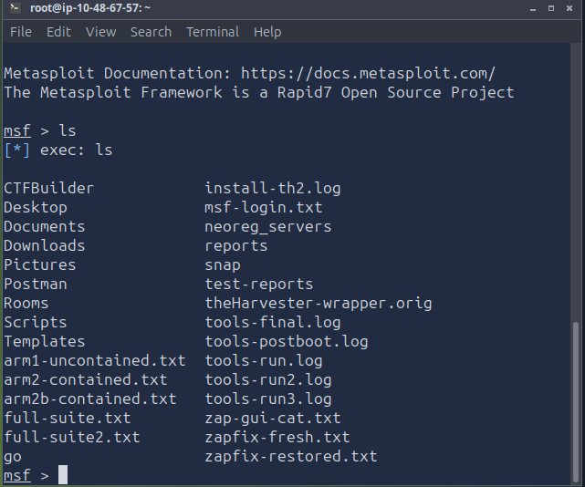
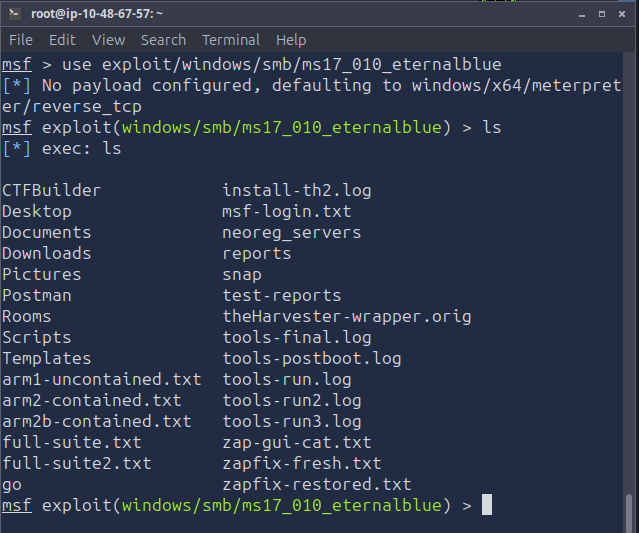
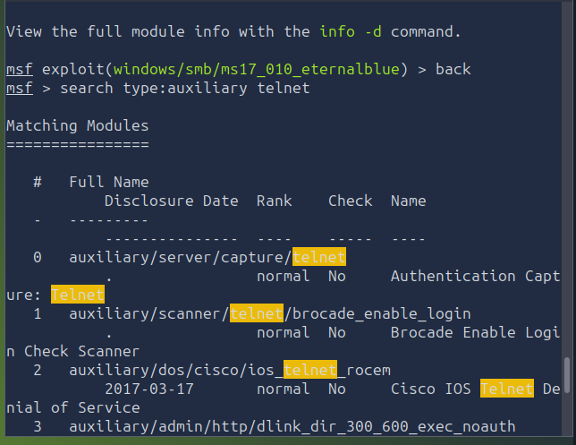
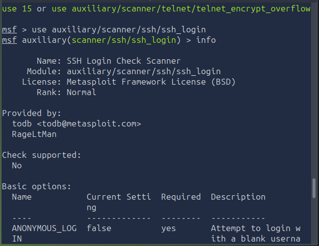

# Metasploit Framework — Basics

**Category:** Exploitation Frameworks

> Lab/CTF use only — authorized targets, never anything you don't own or
> have explicit permission to test.

## Objective
Get a working mental model of Metasploit: what a module actually is, how
payloads differ from exploits, and a repeatable workflow from search to
post-exploitation instead of just memorizing commands in isolation.

## Tools used
`msfconsole`, `msfvenom`, `pattern_create`, `pattern_offset`

## Methodology

### What Metasploit Actually Is
An exploitation and security-testing framework — covers everything from
info gathering and vuln assessment through exploitation and
post-exploitation. `msfconsole` is the main interface you interact with
all of it through.

### The Core Pieces
- **Exploit** — the code/logic that triggers a specific vulnerability
- **Auxiliary** — everything that isn't an exploit but supports the
  workflow (scanners, crawlers, enumeration modules)
- **Payload** — what actually runs on the target once the exploit lands
- **Post** — modules you run after you already have a session
- **Encoder** — reshapes payload bytes into a different representation
- **NOP** — no-op padding, used historically for payload alignment

Plus standalone tools like `msfvenom` (payload generation) and
`pattern_create`/`pattern_offset` (finding offsets during exploit dev).

**The chain:** a vulnerability exists → an exploit triggers it → a
payload runs and gets you a session/result.

### Navigating `msfconsole`
```
msfconsole          # launch it
help / ?             # list commands
back                  # leave current module context
info                  # module details
show options          # module's configurable options
show payloads         # compatible payloads
show exploits         # list exploits
show auxiliary        # list auxiliary modules
show post             # list post modules
```




It behaves like a shell in some ways (`ls` works, tab completion works)
but it isn't a full shell replacement — don't expect normal output
redirection to behave like Bash.

**Context matters.** Selecting a module changes your prompt and scopes
your settings to that module. Switch modules and those settings don't
carry over automatically — for anything that should persist across
modules, use:
```
setg <OPTION> <VALUE>
unsetg <OPTION>
```
Global values quietly affecting a later module is a real way to waste
twenty minutes debugging "why isn't this working" — check `show options`
after switching rather than assuming a clean slate.

### Working With Modules
```
search <keyword>       # query the module database
use <module>            # select one
info                    # what it does
show options             # what it needs
set <OPTION> <VALUE>     # configure it
unset <OPTION>           # clear one option
unset all                # clear everything
```




Search results come with a **rank** — a rough reliability signal, roughly
`excellent > great > good > normal > average > low > manual`. Worth
glancing at before picking a module, especially when several show up for
the same CVE.

Common options you'll set constantly:
```
RHOST     target host
RPORT     target port
PAYLOAD   which payload to use
SESSION   existing session, for modules that need one
```


Always confirm exact option names with `show options` rather than
assuming — they vary per module.

### Payloads

A payload is separate from the vulnerability and the exploit — it's just
"what runs once we're in."

**Singles** — self-contained, no separate staging needed. Simple:
exploit → single payload → done.

**Stagers + Stages** — a stager is small, sets up the initial
connection, then pulls down the actual (larger) stage over that
connection. Point of splitting it this way: keeps what you initially
send to the target small, which matters for exploits with tight size
constraints or when you're trying to avoid tripping something on the way
in.

Staged payload names are usually slash-separated:
`<platform>/<arch>/<stage>/<transport>`. Single payloads don't need that
extra segment. Exact naming varies by platform/arch/Metasploit version —
`show payloads` is the source of truth, not memory.

**Encoders** reshape payload bytes — historically useful for dodging bad
characters or simple signature matches. **Encoding is not encryption**
and doesn't reliably beat modern AV/EDR, which lean on behavioral and
heuristic detection now, not just signatures. Don't confuse encoder ≠
evasion ≠ encryption — three different things that get lumped together
casually but do very different jobs.

**NOPs** (no-operation) — padding/alignment, keeps payload size/layout
consistent in some exploitation contexts. Doesn't do anything on its own.

### Common Commands Reference
```
help / ?                    console help
show options                current module's options
show payloads/exploits/auxiliary/post
info                         module info
search <term>                find modules
use <module>                  select one
back                           leave module
sessions                       list/manage sessions
sessions -i <ID>                interact with one
background                      background current session
set / unset                      module-scoped option
setg / unsetg                     global option
exploit                            run an exploit module
run                                 run a module (where supported)
exploit -z                          run + auto-background the session
```

### A Clean Workflow
```
1. Confirm authorization + scope, identify target
2. msfconsole
3. search <keyword>
4. use <module> → info → show options
5. set required options (RHOSTS, etc.)
6. show payloads → set PAYLOAD → show options (verify)
7. run / exploit
8. sessions → sessions -i <ID> → background as needed
9. post-exploitation modules, staying inside scope
10. cleanup: close sessions, remove test artifacts, reset lab, document findings
```

The workflow discipline matters more than any individual command —
having a fixed order (search → select → configure → verify → run) is
what stops you from firing an exploit with half the wrong options still
set from the last module.

## Detection angle (SOC-relevant)
Everything in this workflow leaves a trail worth knowing about from the
defender's side:
- A successful exploit → payload → session is exactly the kind of event
  chain EDR process/network telemetry is built to catch (unexpected
  child process off a vulnerable service, outbound callback to an
  unfamiliar host).
- Staged payloads specifically generate a **two-stage network pattern** —
  a small initial connection followed by a larger data pull seconds
  later — which is a distinguishable signature from a single payload's
  one-shot connection, useful if you're trying to fingerprint an
  intrusion from network logs alone.
- Encoders/evasion attempts are explicitly *not* a guarantee against
  modern detection — worth remembering both as an attacker (don't assume
  encoding = invisible) and as a defender (don't rely on signature-only
  AV as your only control).

## Key takeaway
The actual skill in Metasploit isn't the command syntax — `search`,
`use`, `set`, `run` covers 90% of it. The skill is picking the right
module for the actual target, understanding what a payload's staging
choice implies about network behavior, and running a workflow
disciplined enough that stale settings from a previous module don't
quietly break (or worse, mis-target) the next one.
