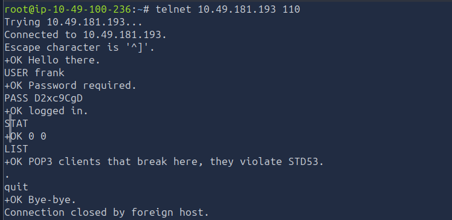
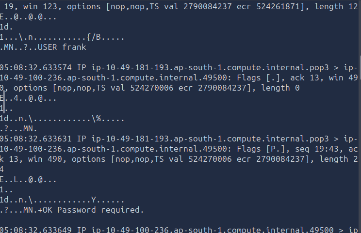
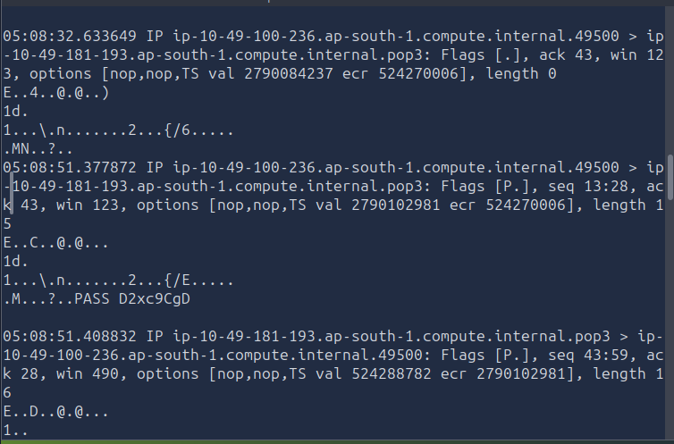
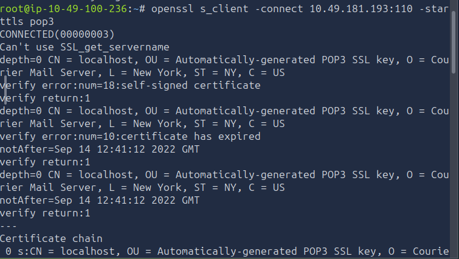
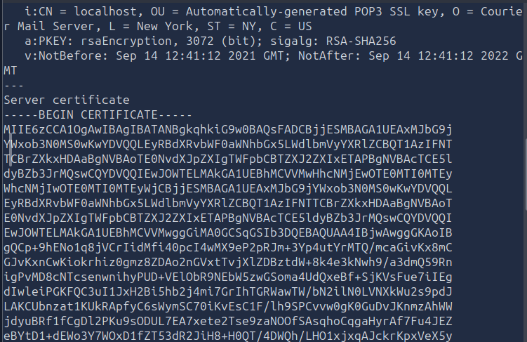

# [Protocols and Servers 2] — TryHackMe

**Path:** Jr Penetration Tester
**Date:** 2026-08-12
**Category:** Reconnaissance → Credential/Traffic Attacks & Mitigation

## Objective
Learn attacks against passwords and cleartext traffic, and the secure
alternatives (SSH, SSL/TLS) that mitigate them.

## Tools used
- Hydra, tcpdump, SSH, Wireshark

## Methodology
- Used tcpdump to sniff on port 110 to capture cleartext POP3 traffic to steal credentials
  got username and password along with commands easily
- Read about MITM attacks , how they can be administered to fool hosts into believing it is connecting to a genuine server.Read about different ways MITM attacks are forged.
- MITM attacks on encrypted networks by forcing target to route through host's PC using unencrypted network.
- Learnt how TLS handshakes work
- Upgrading tls on unencrypted protocols(eg POP3, SMTP, HTTP) using STARTTLS

**Capturing Cleartext traffic using tcpdump on POP3 protocol**

**Connecting POP3 protocol using open_ssl on encrypted connection using STARTTLS**

## Detection angle (SOC-relevant)
Repeated failed auth attempts against a single service in a short window is
a classic, well-documented brute-force detection pattern — a strong
candidate for an early Sigma rule.

## Key takeaway
