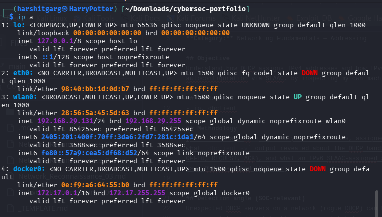
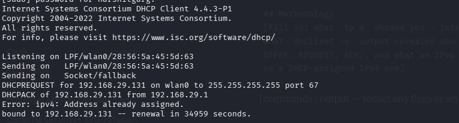
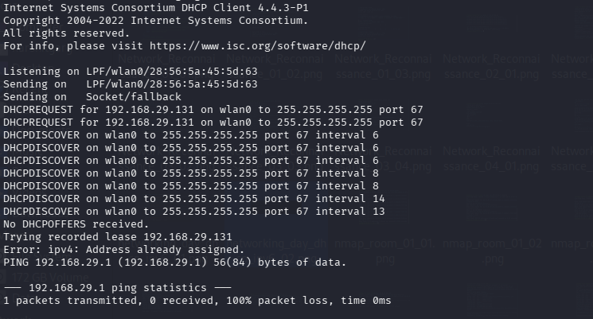

# [DHCP + IPv4 / DORA] — Hands-on Lab Notes

**Path:** Self-study (Network+ / hands-on practice)
**Date:** 2026-08-17
**Category:** Networking Fundamentals — Addressing

## Objective
Understand how DHCP assigns IPv4 addresses and distinguish that from IPv6
address autoconfiguration via SLAAC. The hands-on commands documented here
focus on DHCPv4.

## Tools used
- ip, dhclient

## Methodology
- Running `ip addr` (or the shorthand `ip a`) showed the network
  interfaces and their assigned IPv4/IPv6 addresses. The wireless interface
  `wlan0` was the relevant interface for this exercise.
- Running `sudo dhclient -v wlan0` on a system using the ISC DHCP client
  displayed the DHCPv4 client exchange in verbose mode. The exact client and
  network-management stack can vary by distribution, so `dhclient` may not
  be installed or may not be the component managing the interface.

  

## Detection angle (SOC-relevant)
Unexpected DHCP servers on a network (rogue DHCP) can hijack address
assignment to redirect traffic — a mismatch between expected and actual
DHCP server responses is a detection signal worth knowing.

## Key takeaway
This drill made the DHCPv4 address-assignment process visible in actual
client output. The key sequence to recognize is **Discover → Offer →
Request → Acknowledge (DORA)**.
