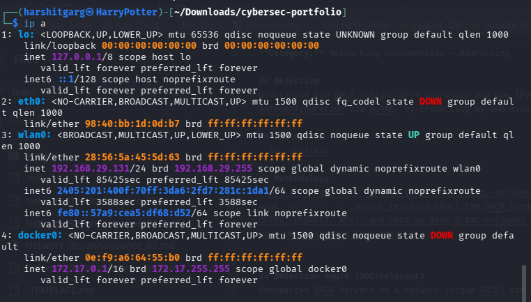
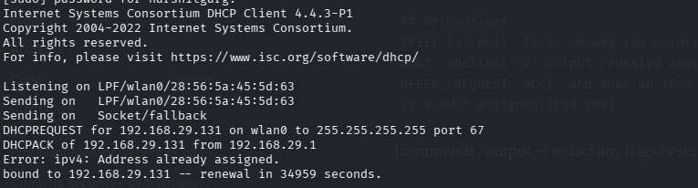
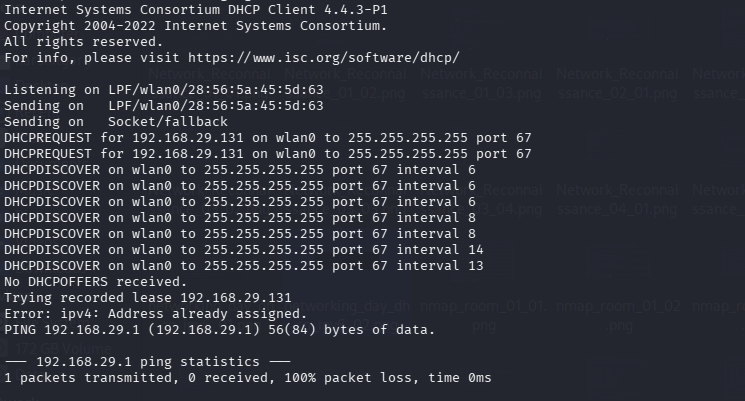

# [DHCP + IPv4 / DORA] — Hands-on Lab Notes

**Path:** Self-study (Network+ / hands-on practice)
**Date:** 2026-08-17
**Category:** Networking Fundamentals — Addressing

## Objective
Understand how DHCP assigns IPv4 addresses and how IPv6 handles address
autoconfiguration via SLAAC, by inspecting my own machine's live config.

## Tools used
- ip, dhclient

## Methodology
- running < ip -a > on my terminal revealed the different network interface on my pc. The most imteresting part was the wlan0 where it clearly showed me on a wireless network with my ip address and othere requisites.
- similarly running < sudo dhclient -v {Network Interface} > here running for wlan 0 showed the DORA requests running in actual time. How on a IPv4 network a pc requests IP address from a DHCP server.

  

## Detection angle (SOC-relevant)
Unexpected DHCP servers on a network (rogue DHCP) can hijack address
assignment to redirect traffic — a mismatch between expected and actual
DHCP server responses is a detection signal worth knowing.

## Key takeaway
This drill showed me exactly how the IP addressing works for IPv4 networks.
