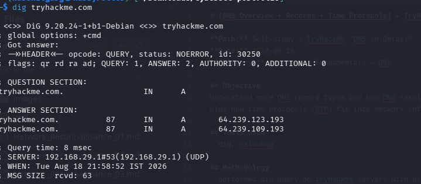
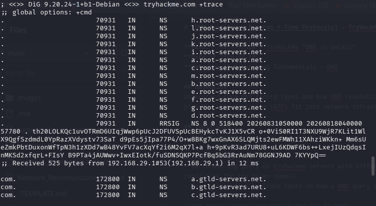
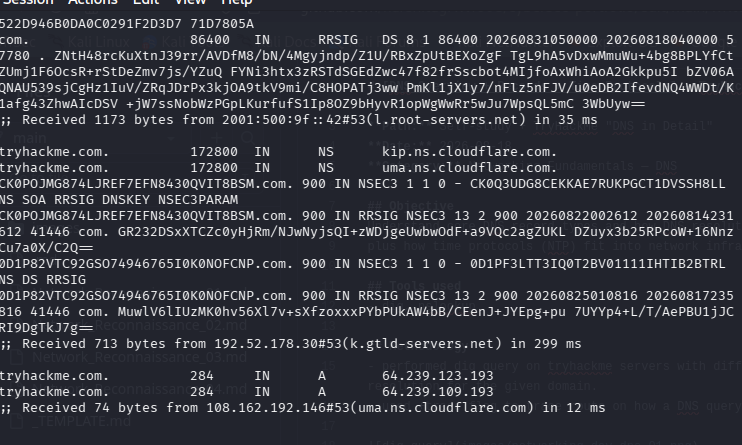

# [DNS Overview + Records + Time Protocols] — TryHackMe / Lab Notes

**Path:** Self-study + TryHackMe "DNS in Detail"
**Date:** 2026-08-18
**Category:** Networking Fundamentals — DNS

## Objective
Understand core DNS record types and how DNS resolution works end to end,
plus how time protocols (NTP) fit into network infrastructure.

## Tools used
- dig, nslookup
  (dig is preferred over nslookup for modern systems)

## Methodology
- performed dig query on tryhackme servers with different flags(A, AAAA, CNAME, TXT, MX, NS etc.) to learn about the dns resolution for the given domain.
- used +trace flag to trace route on how a DNS query is passed down the DNS hierarchy.
- analyzed how in a  DNS hierarchy local cache servers,authoritative servers, and root servers work

## Detection angle (SOC-relevant)
DNS is a common exfiltration and C2 channel (DNS tunneling) — unusual
query volume, oddly long subdomains, or queries to newly-registered
domains are classic DNS-based threat indicators.

## Key takeaway
DNS is like a backbone to network infrastructure. Without DNS servers no one would know which domain name name belongs to which IP address and which name server will respond to the query.
