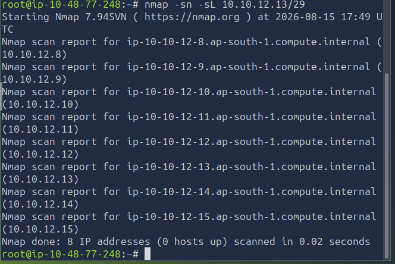
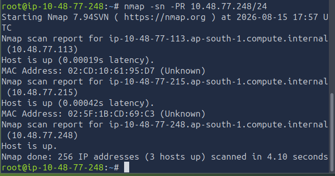
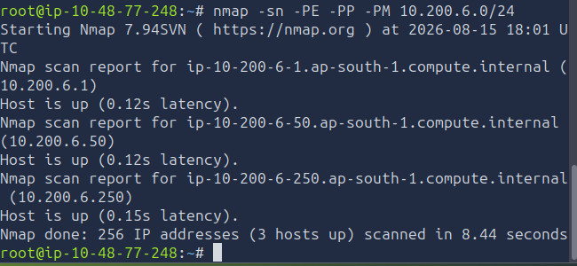
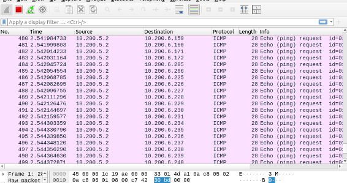

# [Nmap Live Host Discovery] — TryHackMe

**Path:** Jr Penetration Tester
**Date:** 2026-08-12
**Category:** Reconnaissance — Host Discovery

## Objective
Learn how to identify which hosts on a network are alive/reachable before scanning ports, using ARP, ICMP, and TCP/UDP ping sweeps.

## Tools used
- e.g. Nmap, Wireshark

## Methodology
Ran `nmap -sn -sL 10.10.12.13/29` for a quick host discovery sweep — 
found 8 live hosts on network.
Used `-PR` explicitly to confirm ARP-based discovery on LAN; noted it wouldn't work if I were scanning 
a remote subnet, would need ICMP/TCP-based probes instead. Tried -PE/-PP/-PM on a different 
VPN Router subnet and got 3 hosts up and running. Also 
used masscan for a faster sweep on a larger range for comparison, then 
resolved a couple hostnames via rDNS. Captured the ARP/ICMP traffic in 
Wireshark to see what the probes actually looked like on the wire.

```




```

## Detection angle (SOC-relevant)
A sudden ARP broadcast sweep or ICMP flood across a subnet from one host is a classic recon indicator.

