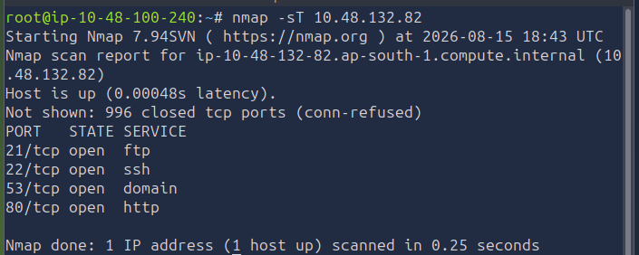
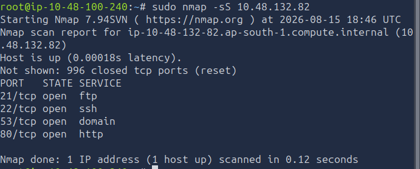

# [Nmap Basic Port Scans] — TryHackMe

**Path:** Jr Penetration Tester
**Date:** 2026-08-13
**Category:** Reconnaissance — Port Scanning

## Objective
Understand how core Nmap scan types work under the hood — TCP connect scan 
vs SYN scan — plus basic UDP scanning.

## Tools used
- Nmap, Wireshark

## Methodology
Ran a TCP connect scan (-sT) — no root needed, completes full handshake, note it's noisier/more loggable

Ran a SYN scan (-sS) — needs root, "half-open," why it's stealthier (no full handshake = less commonly logged by basic services)
Compared timing/output between the two on the same target

Tried a UDP scan (-sU) — note how much slower it was, and why (no handshake, relies on ICMP unreachable responses, lots of retries/timeouts)

Learnt about different types of port states-open,closed,filtered
unfiltered,open/filtered,closed/filtered.

Learnt about Different types of TCP flags- URG,ACK,FIN,SYN,PSH,RST

role of scan timings -T{0-5} (0-slowest and 5-insanely fast)
Set number of parallel probe requests

## Detection angle (SOC-relevant)
SYN scans that never complete the handshake are a classic firewall/IDS 
signature — a burst of half-open connections from one source is the 
indicator to alert on.

## Key takeaway
SYN scans are considered "stealthier" even though they're still detectable 
because the connection is torn down as soon as ACK response is recieved
