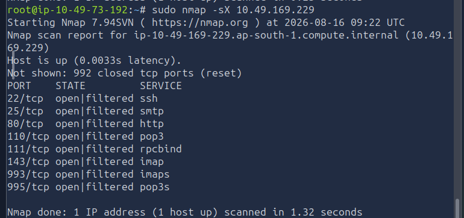
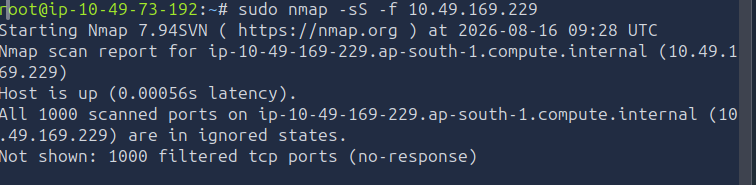
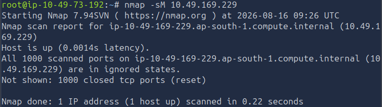

# [Nmap Advanced Port Scans] — TryHackMe

**Path:** Jr Penetration Tester
**Date:** 2026-08-15
**Category:** Reconnaissance — Port Scanning (Evasion)

## Objective
Learn advanced/evasive scan types that manipulate TCP flags to infer port 
state without completing a handshake — useful for slipping past basic 
firewalls and IDS.

## Tools used
- Nmap, Wireshark

## Methodology
Performed a Xmas scan using flag -sX on the THM lab  machine.Discovered few ports
open but filtered.Useful for older systems where closed ports have to reply with RST response.

Fragmented scan(-f or --mtu) is used to split scan packet into multiple fragments which 
can sometimes pass simple packet filtering firewalls not modern stateful firewalls.

Maimon scan exploited a quirk in really old legacy systems. Most modern systems don't 
behave that way.

**Xmas scan output:**

**Fragmented scan output**

**TCP Maimon Scan**

## Detection angle (SOC-relevant)
NULL/FIN/Xmas scans send TCP packets with abnormal flag combinations 
that never occur in legitimate traffic (e.g. FIN set without an active 
connection, or all three flags set together) — any IDS with basic 
signature matching flags these instantly. This is actually one of the 
easiest scan types to detect despite being "evasive" against naive 
firewalls.

## Key takeaway
Stealthy and some tailored scans are much easier to detect 
because of their unusual behavior and requests by properly configured system
