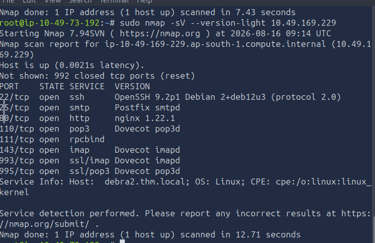
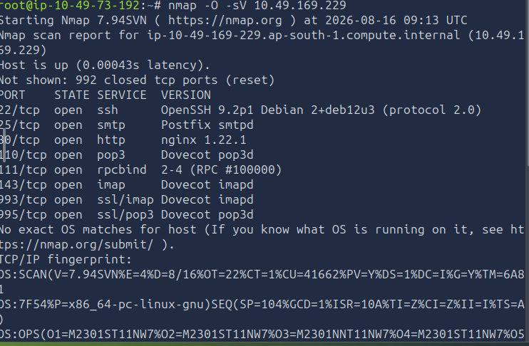
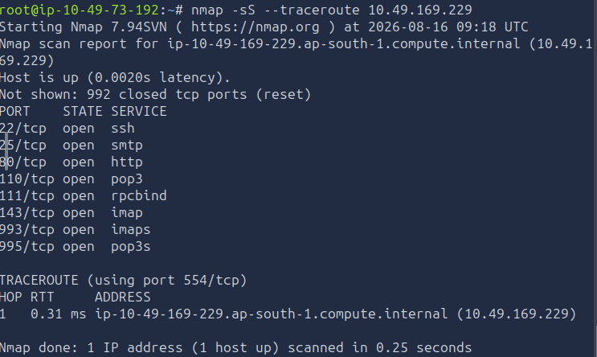
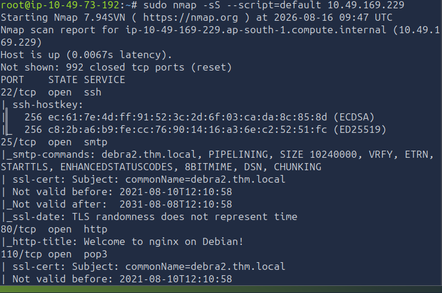
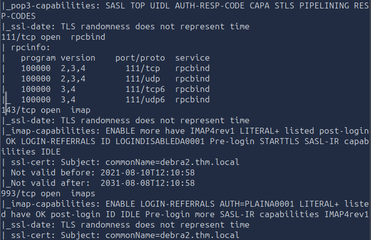
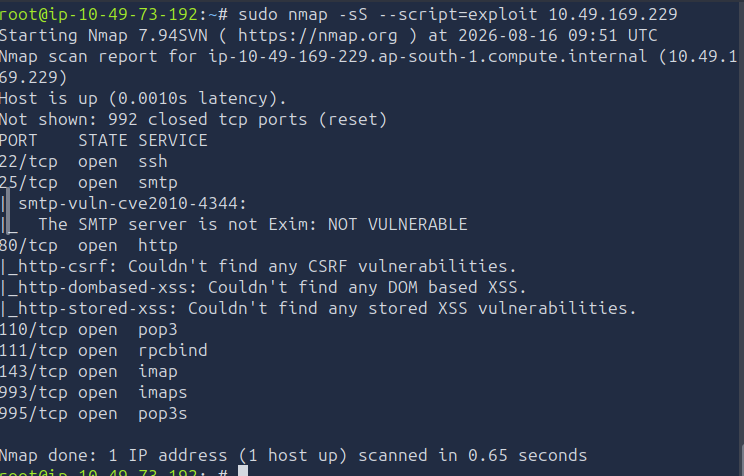

# [Nmap Post Port Scans] — TryHackMe

**Path:** Jr Penetration Tester
**Date:** 2026-08-15
**Category:** Reconnaissance → Vulnerability Scanning (NSE)

## Objective
Move beyond "is the port open" to identifying the actual service, version, 
and OS behind it, and use the Nmap Scripting Engine (NSE) — including 
vuln/exploit-category scripts — to enumerate deeper.

## Tools used
- Nmap, Wireshark, NSE

## Methodology
-sV for service/version detection, and --version-intensity (0–9) or the shortcuts --version-light (intensity 2) vs --version-all (intensity 9) — note the tradeoff: higher intensity = more accurate but slower/noisier

-O for OS detection — how it works (TCP/IP stack fingerprinting quirks) and its accuracy (needs at least one open + one closed port)

--traceroute — note nmap's traceroute works backwards from normal (starts high TTL, decreases) unlike standard OS traceroute

NSE basics: scripts live in /usr/share/nmap/scripts, written in Lua, ~600 scripts by default, organized into categories (auth, brute, default, discovery, dos, exploit, external, fuzzer, intrusive, malware, safe, version, vuln)

-sC (default/safe scripts) vs targeted --script=<name> or --script=<category> — and explicitly flag that brute/exploit/dos categories are intrusive and can crash or actually compromise a service, so you check what a script does before running it

Saving results: -oN (normal), -oX (XML), -oA (all formats at once)

**Service/OS detection output**

**OS detection output**

**traceroute output**

**NSE default scripts output**

**NSE exploit script output**

## Detection angle (SOC-relevant)
This is the noisiest room from a defender's view. Version/OS probing plus 
NSE default or vuln scripts generate a distinct spike in connection volume 
and unusual protocol-level requests to a single host in a short window — 
a strong candidate for a volumetric/rate-based Sigma rule (e.g. many 
distinct probe types from one source IP against one target in <X seconds).

## Key takeaway
1–2 sentences: what you learned or what surprised you.
