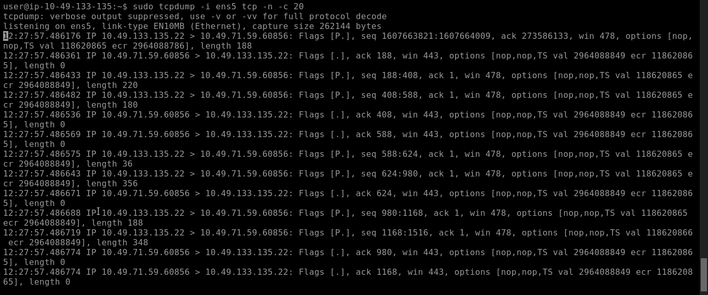
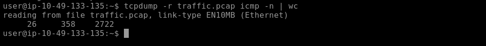
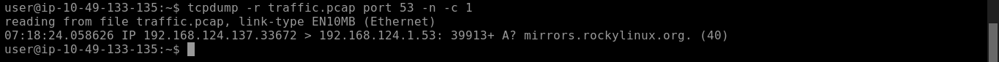
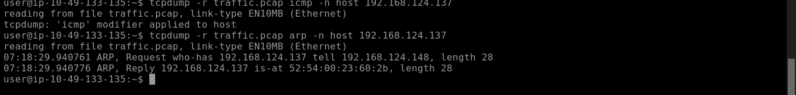

# Tcpdump: The Basics — TryHackMe

**Path:** Cyber Security 101 — Tools
**Date:** 2026-09-07
**Category:** Network Traffic Analysis

## Objective

Companion room to Wireshark, but command-line — tcpdump for capturing and filtering traffic directly from the shell using BPF (Berkeley Packet Filter) expressions. Useful for exactly the situations where a GUI isn't available: a remote box over SSH, a headless server, or just wanting something scriptable.

## Tools used

- tcpdump

## Methodology

Started by figuring out what interfaces actually exist to capture on — `sudo tcpdump -D` lists them directly, or `ip link` works as an alternative if tcpdump itself isn't cooperating for some reason. Once you know the interface name, capturing is just:

```bash
sudo tcpdump -i eth0
```

swapping `eth0` for whatever's actually relevant on the box. On its own this just prints to the terminal, which isn't great for anything you want to keep — `-w capture.pcap` writes raw packets to a file instead, and `tcpdump -r capture.pcap` reads it back later (also how you'd open it in Wireshark afterward for the deeper GUI-side analysis). `-c 100` caps the capture at a fixed packet count, which is a nice guardrail so you don't accidentally leave a capture running and fill a disk.

The reasoning behind saving a pcap at all actually mattered more to me than I expected — it's not just "for later," it's that you can't un-lose traffic once it passes and you weren't capturing. If you're troubleshooting live you can watch output scroll by, but for anything you might need to hand off, prove, or re-analyze, save it.

From there, the option flags. The ones I know I'll actually reach for:

| Option | Purpose |
|---|---|
| `-i` | Select interface |
| `-w` / `-r` | Write to / read from a pcap |
| `-c` | Stop after N packets |
| `-n` / `-nn` | Skip hostname / hostname+service resolution |
| `-v` / `-vv` / `-vvv` | Increasing verbosity |
| `-A` | ASCII payload |
| `-x` / `-xx` | Hex output (with/without link-layer header) |

`-nn` is worth calling out specifically — without it, tcpdump tries to resolve IPs to hostnames and ports to service names (443 becomes "https", etc.), which is friendlier to read but slower and occasionally misleading if DNS is behaving oddly. Numeric output is the more honest default for actual investigation work.

Filtering is BPF syntax, and it reads close enough to plain English that it didn't take long to get comfortable. By protocol:

```bash
sudo tcpdump -i eth0 tcp
sudo tcpdump -i eth0 udp
sudo tcpdump -i eth0 icmp
```





By port, optionally narrowed to just source or destination:

```bash
sudo tcpdump -i eth0 port 443
sudo tcpdump -i eth0 src port 443
sudo tcpdump -i eth0 dst port 80
```



By host/IP, same source/destination split available:

```bash
sudo tcpdump -i eth0 host 192.168.1.10
sudo tcpdump -i eth0 src host 192.168.1.10
```



Then logical operators to combine conditions — `and`, `or`, `not`:

```bash
sudo tcpdump -i eth0 'host 1.1.1.1 and tcp'
sudo tcpdump -i eth0 'not arp'
sudo tcpdump -i eth0 '(tcp port 80 or tcp port 443) and host 192.168.1.10'
```

Quoting the whole expression turned out to matter more than I expected the first time I forgot — the shell itself interprets parentheses, so an unquoted filter with `()` in it just breaks in a confusing way that has nothing to do with tcpdump's syntax.

The more advanced filtering got into actual byte-level packet inspection, which was new territory for me. Length-based filtering is straightforward — `greater 1500` or `less 100` — good for spotting unusually large or small packets. The byte-offset stuff is where it got more interesting: `tcp[tcpflags]` is shorthand for checking TCP flag bits directly, so you can filter for just SYNs, FINs, or RSTs:

```bash
sudo tcpdump -i eth0 'tcp[tcpflags] & tcp-syn != 0'
```

The general form behind this is `proto[expr:size]` — protocol, byte offset, number of bytes to check — and the room's warning about this made sense once I tried it: offsets are protocol-dependent, so this only works if you actually know the header layout you're poking at. Using the named flag shorthand (`tcp-syn`, `tcp-fin`, `tcp-rst`) is safer than hand-calculating offsets when the option's available.

Closed out on display/output options and a handful of practical one-liners — `-A` for ASCII payload (great for catching plaintext HTTP), `-x`/`-xx` for hex, `-vv` for verbose, and combinations like:

```bash
sudo tcpdump -i eth0 -nn 'udp port 53'
sudo tcpdump -i eth0 -nn -w filtered.pcap 'tcp port 443'
sudo tcpdump -i eth0 -nn -c 100 'tcp port 443'
```

which is basically the shape every real capture command of mine is going to take — numeric output, a specific filter, and either a count cap or an output file so it doesn't run forever.

## Detection angle (SOC-relevant)

tcpdump itself doesn't generate alerts, but it's exactly the tool you'd reach for once something else has already flagged a host or a time window and you need to go confirm it directly — SSH into a box, run a targeted capture with `-nn` and a tight filter, and either read it live with `-A`/`-x` or save it and hand it off for deeper Wireshark analysis. The BPF byte-offset filtering (`tcp[tcpflags]`) is genuinely useful here too — isolating just SYN packets is a fast way to eyeball scan activity or connection attempts without wading through full sessions.

## Key takeaway

tcpdump earns its keep specifically in the situations where Wireshark isn't an option — remote, headless, scriptable. The BPF filter syntax carries over conceptually to a lot of other tools too, so getting comfortable with `and`/`or`/`not`, port/host filter would really help.
