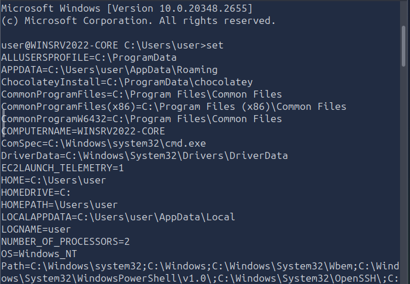
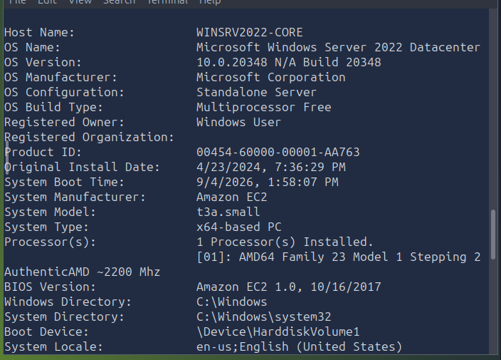
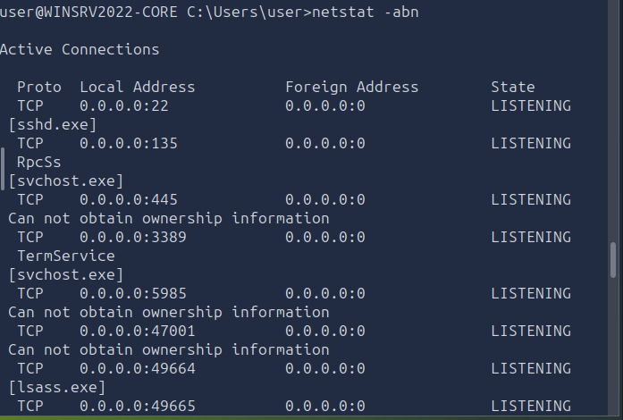

# Windows Command Line — TryHackMe

**Path:** Cyber Security 101 — Command Line
**Date:** 2026-09-05
**Category:** Windows / Command-Line Fundamentals

## Objective

First room in the Command Line module — basically a tour of CMD itself: pulling system info, troubleshooting network config, managing files/directories, and keeping an eye on processes. Nothing offensive here, just building fluency with the tool before PowerShell.

## Tools used

- Command Prompt (cmd.exe)
- systeminfo, ipconfig, ping, tracert, nslookup, netstat
- tasklist, taskkill
- chkdsk, sfc, driverquery

## Methodology

Started with the basic "where am I" commands — `set` to dump environment variables (and `set PATH` if I just want that one), `ver` for the Windows version, and `systeminfo` for the fuller picture: OS build, hostname, installed updates, memory, network info all in one shot. `help` and `help dir` are handy when I forget a command's exact flags instead of tabbing over to search every time.





Networking is where CMD actually gets useful fast. `ipconfig /all` is the one I'll be running constantly — IP, subnet, gateway, DNS servers, MAC address, DHCP status, all in one place. `ping` confirms basic reachability (ICMP echo request/reply), `tracert` shows the hop-by-hop path so I can tell *where* a connection is dying instead of just that it's dead, and `nslookup` answers DNS questions — including against a specific server if I want to rule out a bad resolver:

```cmd
nslookup example.com
nslookup example.com 1.1.1.1
```

`netstat` rounds this out — connections and listening ports. The flag combo I'll actually remember is `-ano`: all connections, numeric addresses/ports, and the owning PID, which is the one that matters most if I'm trying to tie a weird connection back to a process.




File and disk side was mostly familiar ground — `cd`, `dir`, `tree` for navigation, `mkdir`/`rmdir` for directories (`rmdir /s` if it's not empty), `type` to dump a text file and `type file.txt | more` if it's long enough to need paging. `del` deletes — no undo, no confirmation by default, so double-check the target before hitting enter.

Process management: `tasklist` to see what's running, and you can filter it down instead of scrolling through everything —

```cmd
tasklist /FI "IMAGENAME eq sshd.exe"
```

— then `taskkill /PID <PID>` to end something, `/F` if it's not cooperating. The workflow is basically tasklist → spot the PID → taskkill it.

Last section was admin/maintenance tools: `chkdsk` for filesystem errors and bad sectors (`chkdsk C: /f` to actually fix things, needs admin and sometimes a restart), `driverquery` to list installed drivers, `sfc /scannow` to check and repair protected system files (run elevated), and `shutdown` with `/s`, `/r`, or `/a` to abort a pending one.

## Detection angle (SOC-relevant)

None of these commands are inherently suspicious — that's actually the interesting part. `tasklist`, `netstat`, `ipconfig` are all completely normal admin behavior on their own. What'd actually raise a flag is context: these commands running from an unexpected parent process, at an odd hour, on a machine that isn't normally administered interactively, or immediately preceded/followed by something like a `taskkill` on a security product's process. Command-line logging (if enabled via Sysmon or similar) is what would actually let a SOC see this activity in the first place — plain CMD usage doesn't show up in the Security log by default.

## Key takeaway

CMD is a lot more capable than "the black window you close accidentally" — between systeminfo, ipconfig, netstat, and tasklist, that's already most of a basic triage kit. Good baseline before PowerShell, which does the same jobs but with a lot more power behind them.
