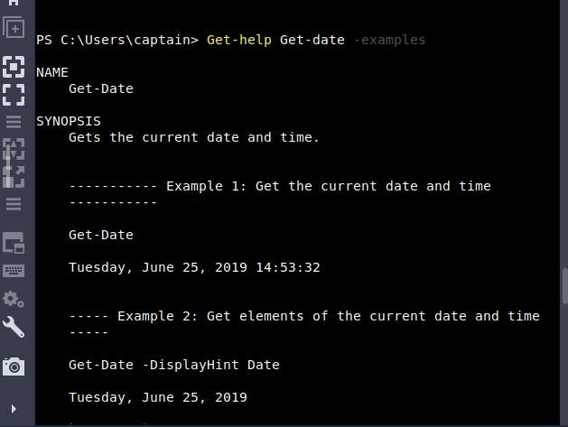
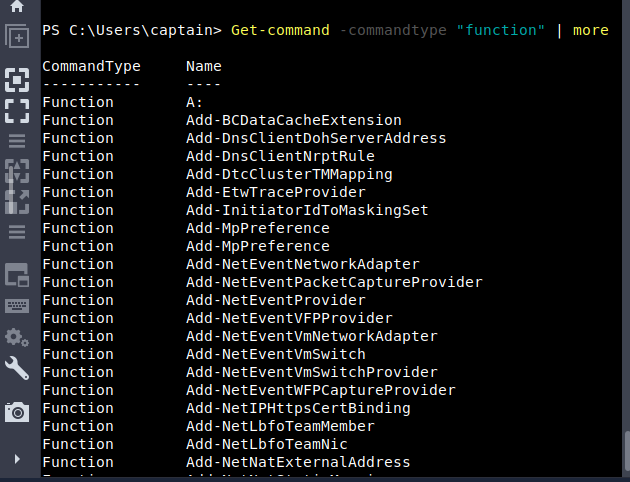
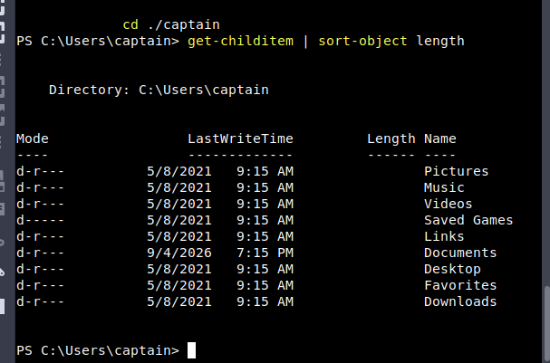
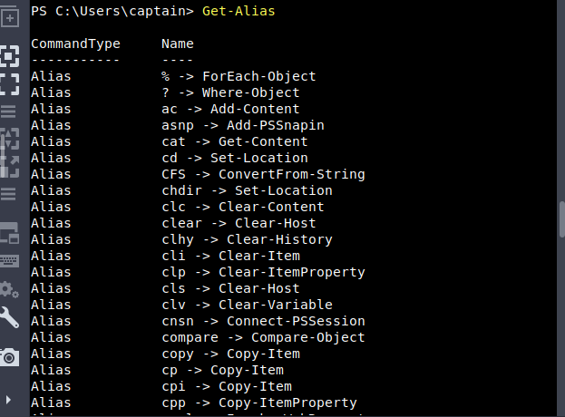

# Windows PowerShell — TryHackMe

**Path:** Cyber Security 101 — Command Line
**Date:** 2026-09-05
**Category:** Windows / Scripting & Automation

## Objective

Second room in the module, and the step up from CMD — PowerShell as an object-oriented shell and scripting language, not just a text-in/text-out tool. Covers cmdlets, aliases, the pipeline, and using it for actual system/network investigation.

## Tools used

- Windows PowerShell
- Get-Command, Get-Help
- Get-Process, Get-Service, Get-NetTCPConnection
- Get-FileHash

## Methodology

The framing that stuck with me right away: CMD passes around plain text, PowerShell passes around actual objects with properties you can filter and sort on. That single difference is basically why the rest of the room works the way it does.

Cmdlets follow a Verb-Noun pattern — `Get-Content`, `Set-Location`, `Get-Process`, `Get-Service` — which makes them weirdly guessable once it clicks. Verb says what's happening, noun says what it's happening to.

If I don't know the exact cmdlet I want, `Get-Command` finds it — `Get-Command *process*` narrows by keyword. `Get-Help` is the docs, and it actually gets useful with `-Detailed`, `-Examples`, or `-Full` depending how deep I need to go. Aliases (`Get-Alias`) are the shortcuts that let old CMD/Linux muscle memory keep working — `dir` maps to `Get-ChildItem`, `cd` maps to `Set-Location` — good for typing fast interactively, but the room's advice to spell out full cmdlet names in actual scripts makes sense; a script that reads `dir` isn't obviously self-documenting to someone else later.





File-system navigation is basically CMD's commands with PowerShell names — `Get-ChildItem` (list), `Set-Location` (cd), `New-Item` (create file or folder depending on `-ItemType`), `Remove-Item`, `Copy-Item`, `Move-Item`, `Get-Content` (read a file). Nothing conceptually new here, just relearning the noun.

The pipeline (`|`) is where PowerShell actually earns the hype. Instead of piping raw text like CMD would, it's handing a stream of objects from one cmdlet straight to the next:

```powershell
Get-ChildItem | Sort-Object Length
Get-ChildItem | Where-Object Extension -eq ".txt"
Get-Process | Select-Object Name, Id
```



`Where-Object` filters using comparison operators (`-eq`, `-ne`, `-gt`, `-ge`, `-lt`, `-le`, `-like`), and `Select-Object` trims the output down to just the properties I actually care about, or grabs the first N results. `Select-String` is basically PowerShell's version of grep — pattern search across text.


Then the more investigation-flavored cmdlets: `Get-ComputerInfo` for a system overview, `Get-LocalUser` for local accounts, `Get-NetIPConfiguration`/`Get-NetIPAddress` for network config (the latter also surfaces inactive interfaces, worth remembering), and `Get-NetTCPConnection` for active TCP connections — the PowerShell equivalent of `netstat`, just returned as filterable objects instead of raw text.

`Get-Process` and `Get-Service` round out the "what's actually running on this box" picture — process name, PID, CPU/memory for the former; service name and state (running/stopped) for the latter. `Get-FileHash` was the one I found most directly useful for security work — hash a file (SHA256 by default settable) and you've got something to compare against known-good or known-bad values:

```powershell
Get-FileHash -Path ".\file.exe" -Algorithm SHA256
```

Last stop was Alternate Data Streams again, this time from the PowerShell side — `Get-Item -Path ".\file.txt" -Stream *` to actually see what streams are attached to a file. Same idea as the CMD `dir /r` version from the earlier Windows Fundamentals room, just a cleaner way to enumerate it.

One thing I found interesting was how simple linux commands were running smoothly without errors in a windows powershell.
On investigation, I found existence of aliases which are in simple terms short forms for cmdlets in built into windows powershell for easy usage bu unix-type OS users.



## Detection angle (SOC-relevant)

PowerShell logging is a much bigger deal than CMD logging — Script Block Logging and Module Logging can capture what actually ran, not just that powershell.exe launched. Given how much legitimate admin work happens in PowerShell, the interesting signal usually isn't "PowerShell ran" (that's constant, everywhere), it's *what* ran — encoded commands, download cradles, unusual `Invoke-` usage, or scripts touching LSASS/credentials. Also worth remembering: aliases mean the same malicious action can be written a dozen different surface-level ways, so detection that only string-matches full cmdlet names is going to miss stuff.

## Key takeaway

PowerShell isn't just "CMD with more commands" — the object pipeline changes how you actually work with output, and that's the part worth internalizing over memorizing every cmdlet.  Once Get-X / pipe / filter / select becomes a reflex, most of what I need is really just picking the right noun.
Also powershell is much more powerful than command line and its in-built aliases are great for those who are not familiar in windows command line syntax.
