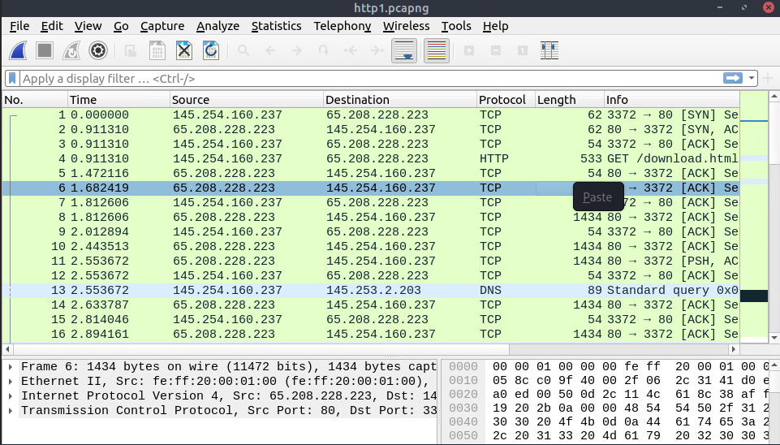
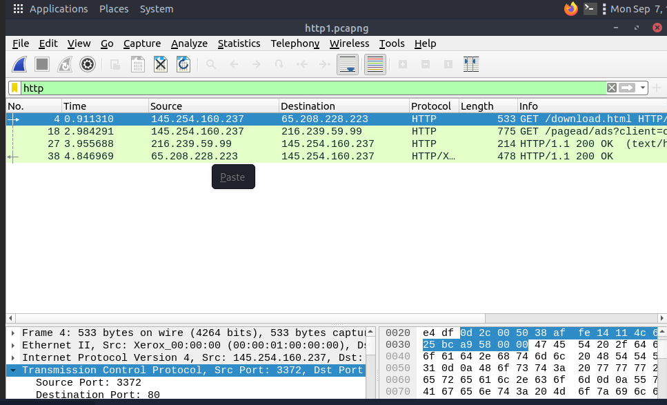
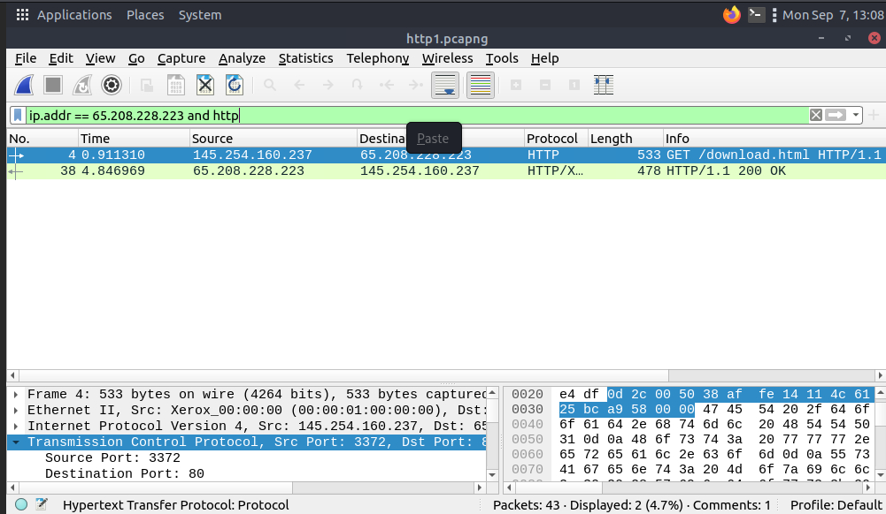
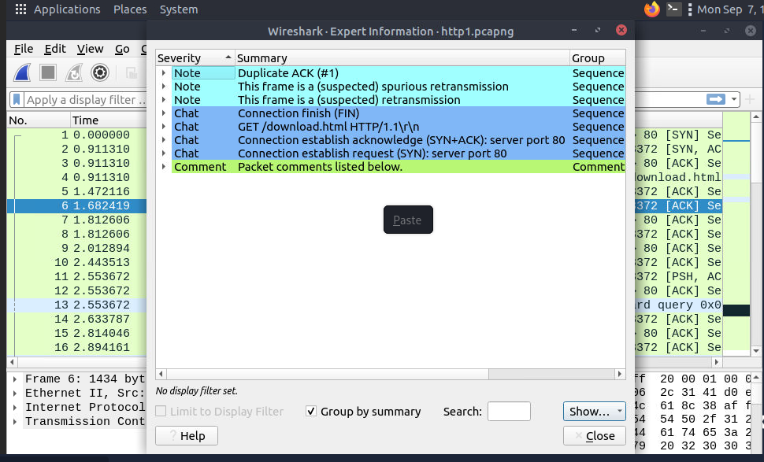

# Wireshark: The Basics — TryHackMe

**Path:** Cyber Security 101 — Tools
**Date:** 2026-09-07
**Category:** Network Traffic Analysis

## Objective

This room is the intro to Wireshark — how the interface is laid out, how to actually capture something, how packets get broken down into layers, and how to filter/navigate/export what you find. Goal was to get comfortable enough with the tool that I'm not fumbling around the UI mid-investigation later.

## Tools used

- Wireshark

## Methodology

Started with the basics of what Wireshark actually does — capture traffic, decode it by protocol layer, filter it down, and reconstruct conversations so you can read them at the application level (assuming the traffic isn't encrypted). Capturing itself is simple in theory: pick the right interface, start the capture, generate or wait for traffic, stop it. The room lists the usual interface types — Ethernet, Wi-Fi, Loopback, VPN/tunnel interfaces — worth remembering loopback exists as an option since local traffic between processes on the same machine won't show up on a normal NIC capture.



The interface itself splits into three panes that all work together: Packet List (the summary line — number, time, source, destination, protocol, length, info), Packet Details (the same packet expanded down through its protocol layers — Frame → Ethernet II → IP → TCP → HTTP, that kind of chain), and Packet Bytes (the raw bytes plus their ASCII equivalent, which is honestly where I'd go hunting for readable strings or header data by eye).

One distinction I made sure to actually lock in rather than gloss over: capture filters decide what gets collected *while* capturing, display filters decide what gets *shown* after the fact from everything you already captured. Different syntax, different job, easy to mix up if you're moving fast.

Packet dissection is really just that Packet Details pane in more depth — pulling apart Frame (capture metadata), Ethernet (source/destination MAC, EtherType), IP (source/destination IP, TTL, protocol), TCP (ports, sequence/ack numbers, flags, window size), UDP (ports, length, checksum), and then whatever application-layer protocol shows up on top — HTTP, DNS, FTP, SMB, TLS, DHCP, ICMP. Wireshark will also flag protocol-level problems on its own — malformed packets, checksum issues, retransmissions, segment reassembly, deprecated behavior — but the room's framing on this stuck with me: treat those as investigation clues, not proof of anything malicious by themselves. A retransmission usually just means bad network conditions, not an attack.

Display filtering is where the room actually gets hands-on. Basic protocol filters are just the protocol name:

```text
tcp
udp
dns
http
icmp
arp
tls
```



Port and IP filters follow a `field == value` pattern:

```text
tcp.port == 443
udp.port == 53
ip.addr == 192.168.1.10
ip.src == 192.168.1.10
```

and you can chain them with `&&` (AND), `||` (OR), or `!()` (NOT):

```text
ip.addr == 192.168.1.10 && tcp.port == 443
tcp.port == 80 || tcp.port == 443
!(arp)
```



**Edit → Find Packet** lets you search inside the capture by display filter, hex value, string, or regex — useful when you know roughly what you're looking for but not which packet number it's in. And right-clicking a packet/conversation to build a filter directly from it is a nice shortcut for isolating one host or flow without hand-typing the whole expression.

Navigation-wise: **Go → Go to Packet** jumps straight to a packet number (handy when a task or a colleague points you at a specific one), right-click marking highlights packets temporarily so you can find your way back to them, and packet comments let you actually annotate *why* something mattered — which persists with the capture if the file format supports it, unlike marking which is just a session-level aid. **View → Time Display Format** is worth knowing about too — switching to "seconds since previous packet" made it a lot easier to reconstruct the order of events in a sequence instead of just staring at absolute timestamps.

Following a stream (**Analyze → Follow → TCP Stream**) reconstructs a full conversation so you can read it like a transcript instead of packet-by-packet — great for unencrypted HTTP, spotting credentials or commands sent in plaintext, or just understanding a client/server exchange as a whole. Important caveat that's easy to forget when you're excited a stream reconstructed cleanly: HTTPS/TLS won't hand you readable content this way — you'd need the actual session keys, which is a different problem entirely.

Last section covered getting data *out* of Wireshark: **File → Export Specified Packets** for sharing a smaller evidence set instead of a whole capture, **File → Export Objects → <protocol>** for pulling out files that were actually transferred inside the capture (HTTP, SMB, TFTP, DICOM are the common ones), and **File → Merge** for combining multiple capture files when evidence is split across them. **Statistics → Capture File Properties** rounds it out — file hash, start/end time, comments, interfaces, stats — good for establishing context before diving in properly.



The Expert Information system (under Analyze) categorizes protocol conditions by severity — Chat, Note, Warn, Error — for things like checksum issues, malformed packets, retransmissions, deprecated protocol usage. Same caveat as before: these are hints worth investigating, not a verdict. Coloring rules (**View → Coloring Rules**) are a different tool for a similar goal — instead of hiding non-matching packets like a display filter does, coloring keeps everything visible but makes matching traffic visually pop, which is nice when you want the full picture but still want certain traffic to jump out at a glance.

## Detection angle (SOC-relevant)

Everything in this room is really a manual investigation workflow rather than something that generates its own alerts — Wireshark is what you reach for *after* something else (a SIEM alert, an IDS hit, a suspicious host) points you at a capture. That said, the skills map directly onto SOC work: filtering down to a host/port/conversation fast, following a stream to confirm whether credentials went out in the clear, and using Expert Information as a first-pass triage before manually eyeballing every packet. The big one to remember: Wireshark reading a stream cleanly doesn't mean the traffic is benign, and Wireshark *failing* to reveal content (because it's encrypted) doesn't mean it's safe either — it's a lens, not a verdict.

## Key takeaway

Wireshark's real value isn't the tool itself, it's the mental model underneath — capture vs display filters, layered dissection, and the discipline to treat expert warnings/colouring as pointers rather than conclusions. Once that framing was solid, the actual button-clicking (Follow Stream, Export Objects, Find Packet) felt more like syntax than substance.
